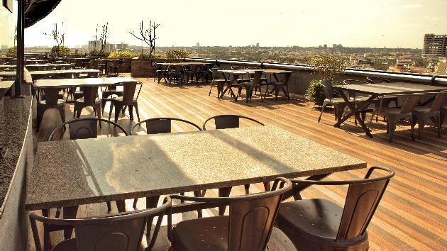

<!--StartFragment-->

Koramangala with its wide roads (when compared to other parts of the city), tree-lined streets, beautiful homes and aesthetic apartment buildings has always been a much sought after neighbourhood to live in. Considered as one of the most centrally located areas of Bangalore, Koramangala can be accessed with various public transport options.

When the tech boom happened, this area that is in between Electronic city and Bengaluru proper, took off. Young professionals flocked to live here. Which meant tons of offices, restaurants, pubs and commercial buildings came up.

The other side of the coin is that tons of development work are constantly happening like construction projects, the building of the Ejipura- Kendriya Sadan flyover, and new sewage pipes being put in among others. Roads are constantly being dug up and structures being demolished. Which means residents have to face traffic woes along with noise and air pollution. So, if you live in this area you definitely want a space close by to work from.

Koramangala has become the startup hub of Bengaluru. Many of India's leading startups like Instamojo, HackerEarth, Explara and Furlenco all hail from Koramangala. If you are a young startup or you live in Koramangala you would be looking for affordable office options. This list will make your job easy. 

Here is the list of top 10 coworking spaces in Koramangala: 

- [OYO Workflo](#oyo-workflo)
- [91 Springboard](#91-springboard)
- [Draper Startup House](#draper-startup-house)
- [Indiqube](#indiqube)
- [One Co.Work](#one-cowork)
- [Sparkplug](#sparkplug)
- [Novel Offices](#novel-offices)
- [365 Shared Space](#365-shared-space)
- [Xplore Next](#xplore-next)
- [Incubex Coworking](#incubex-coworking)

### OYO Workflo
Workflo has gone on to become one of the top brands in coworking in India. OYO has further expanded its network of coworking spaces after their acquisition of Innov8.

Workflo is known for providing best of the amenities at affordable rates. This OYO Workflo location is not an exception to that. This space is a premier space for you to get cracking at your tasks for the day. With numerous amenities and serenity, you are assured to experience a superlative office ambiance. 

This Oyo Workflo also has a location advantage. It is located bang opposite to Forum Mall and also the metro station is right across. 

OYO Workflo provides [day passes](https://gofloaters.com/office-space/gooffice-2250-open-desks-adugodi-bengaluru/) starting at a special rate for GoFloaters members at Rs 199 / pp / day, [meeting rooms](https://gofloaters.com/meeting-space/gospace-2368-4-seater-meeting-room-koramangala-bengaluru/) starting at Rs 500 / hour and flexi-passes if you dont want to take up a regular office on rent. 

**Address**

4th and 5th Floor, Umiya Emporium, Opposite Forum Mall, 
Hosur Main Road, Koramangala, Bengaluru, Karnataka 560029, India
                        
### 91 Springboard

91 Springboard in Koramangala is one of the premium coworking spaces in Koramangala. There are two locations of 91 Springboard in Koramangala. One is in 7th block which is opposite to Forum Mall and the other in 8th block near passport office. 

91 Springboard offers the premium amenities at value for money prices. You can get yourself [hot desks](https://gofloaters.com/office-space/gooffice-2454-open-desks-koramangala-bengaluru/) for a day starting at a special rate for GoFloaters members at Rs 350 / pp / day and meeting rooms starting at Rs 500 / hour. 

**Address**

Location 1:
4th Floor, No 22, Salarpuria Towers-I Industrial Layout, Hosur Rd, 7th Block, Koramangala, Bengaluru, Karnataka 560095

Location 2: 
Padmavathi Complex, 3rd Floor, 80 Feet Rd, Koramangala 8th Block, Koramangala, Bengaluru, Karnataka 560095

### Draper Startup House

Draper Startup House is an international brand in startup spaces. Draper Startup House has the mission of making hospitality the foundation of an entrepreneurial ecosystem. They have a flagship location in Koramangala.

DSH's has an enviable ecosystem of startups who work and live out of the space. The [day passes](https://gofloaters.com/office-space/gooffice-2248-open-desks-office-space-koramangala-bengaluru/) start for as low as Rs 250 / pp / day. The [meeting spaces] are available from Rs XYZ / hour. 

**Address**

384, 1st A Cross Rd, 7th Block, Adugodi, Bengaluru, Karnataka 560030

### Indiqube
Indiqube spaces are known for their practical, contemporary design and valuue for money spaces. Indiqube has also been home to some popular startups like FreshMenu, Redbus and Lendingkart. 

 

Indiqube Koramangala is a 26k sq ft space that is home to diverse, established and global companies. Situated on the main road, it comes with ample space within the campus for employee and visitor parking.

Indiqube's [day passes](https://gofloaters.com/office-space/gooffice-2469-open-desks-sg-palya-bengaluru/) are available at rates starting Rs 250 / pp / day. [Meeting spaces] are available at rates starting Rs Xyz / hr.

**Address**

Lexington Towers, Tavarekere Main Rd, Tavarekere, S.G. Palya, Bengaluru, Karnataka 560029

### One Co.Work
One Co.Work calls themselves India's first hospitality inspired coworking. They are also a pan-India chain of coworking spaces.  

 

One Co.Work puts community in the center of the experience that they offer. Events and networking form a big part of the experience of working at One Co.Work spaces. Some of the noteworthy startups that operate from One Co.Work spaces are Guerillas.in, Hundred Times Company and The Writing Studio. 

One Co.Works [day passes](https://gofloaters.com/office-space/gooffice-2460-open-desks-koramangala-bengaluru/) are available at rates starting Rs 499 / pp / day for GoFloaters members. [Meeting spaces] are available at rates starting Rs Xyz / hr.

**Address**

2/3, 2nd Floor, 80 Feet Road, Barleyz Junction, Koramangala, Bengaluru, Karnataka-560034

### Sparkplug
Sparkplug is a single location coworking space that makes Koramangala its home. Their minimalist and aesthetically designed space provides a creative environment of work culture for a gamut of business ventures. Freelancers equally find themselves at home at Sparkplug coworking. Their spaces are priced attractively for bootstrapped startups too.

 

[Meeting spaces](https://gofloaters.com/meeting-space/gospace-2598-4-seater-meeting-room-koramangala-4th-block,-koramangala-bengaluru/) at Sparkplug are available at rates starting Rs 199 / hr.

**Address**

No. 42, 100 Feet Road, Koramangala 4 th Block, Bangalore 560034

### Novel Offices
Novel Office is probably the only coworking player who has as many as 6 coworking spaces in just Koramangala. Novel Office offers coworking spaces in Bfor entrepreneurs, startups, freelancers, and individual workers. They have visually appealing co-working spaces at prime locations of Bangalore. They provide tailor-made office spaces that suit best to your team. Novel Offices are also open 24x7.

Novel Office prides itself in having marquee clients like Ola, Unacademy, Collabera and Capgemini. 

 

[Day passes](https://gofloaters.com/office-space/gooffice-2340-open-desks-halasuru-bengaluru/) at Novel Office are available at rates starting Rs 249 / pp / day.

**Address**

80 Feet Rd, 4th Block, Koramangala, Bengaluru

### 365 Shared Space
365 Shared Space is a contemporary workspace with all amenities for startups, SMEs, professionals, freelancers and small enterprises. They have 4 locations in Bengaluru, one of which is in Koramangala 4th Block.

 

[Day passes](https://gofloaters.com/office-space/gooffice-2340-open-desks-halasuru-bengaluru/) at 365 Shared Space are available at rates starting Rs 600 / pp / day.

**Address**

No. 18, 80 Feet Rd, Koramangala 4th Block, Koramangala, Bengaluru

### Xplore Next
If you are on the lookout for budget meeting and hot desks in Koramangala then you need to look at this functional coworking space located in Koramangala 6th block. 

 

[Day passes](https://gofloaters.com/office-space/gooffice-2267-open-desks-koramangala-bengaluru/) at Xplore Next are available at rates starting Rs 250 / pp / day. [Meeting Spaces](https://gofloaters.com/meeting-space/gospace-2233-10-seater-meeting-space-koramangala-bengaluru/) are available at Rs 350 / hr and onwards. 

**Address**

114, 3rd Floor, ALR Building, 6th Cross Rd, 6th Block, Koramangala, Bengaluru

### Incubex Coworking
Incubex has two spaces in Koramangala out of the 9 spaces that they have across Bengaluru. Incubex has created an ecosystem for enterprises, startups and entrepreneur community by providing that right workspace combined with the community experience that fosters innovation. 

 

[Meeting Spaces](https://gofloaters.com/meeting-space/gospace-2538-4-seater-meeting-room-koramangala-bengaluru/) are available at Rs 299 / hr and onwards. 

**Address**

126, 1st Cross Rd, KHB Colony, 5th Block, Koramangala, Bengaluru

Post pandemic startups and SMBs are embracing hybrid work models that provide their employees the best of both worlds. The employees can work remotely most of the time yet come together as a team when needed. Coworking spaces with their flexible plans provide the much needed flexibility.

GoFloaters has been helping 1000s of freelancers and startups with their flexible office space requirement over the last 3 years. We are committed to providing affordable spaces on a pay-per-use model so thar you get to have an office when you and where you want. 

<!--EndFragment-->
