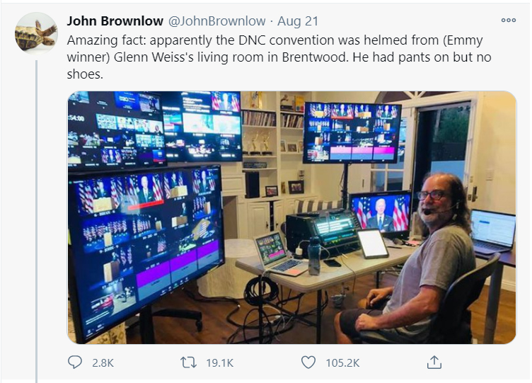

<!--StartFragment-->
 

What a joy to skip traffic mile!  

What a happiness to avoid gasoline fill-up, emptying purse!  

What wonderfulness not to skip breakfast, lunch, tiffin, dinner that too homely!  

What a beautiful thing to be with spouse and kids and not to be too!  

No Travel, No TA/DA; yet lot of liquidity at hand!  

No Visits, No Visitors; yet lot of enjoyment at home!  

No Party, No Get-together; yet, merry making at home front!  

No school dropping/drop-up, No Uniform wash, No, need to remember ID card No need to pack TWO tiffin boxes, water bottle, fruits, juice pack!  

 

But Alas! Its time to choose to containments, luxuries and or balance. 

What began as a necessity has now turned our lives 360 degree! 2020 & COVID-19 have been the accelerant of <a href="https://gofloaters.com/blog/how-we-built-our-healthy-remote-start-up/">culture and lifestyle</a> that we have never encountered before. 

Remote working culture has grown popular and acceptable as the modern way of life since the last 8 months. The swift digital transformation and adaptation to Remote Working across the globe and industries has given us opportunities to rekindle our work models and life. 

Here are 10 powerful quotes from that prove <a href="https://gofloaters.com/">remote working</a> is the future:

 

**1. ON MINDSET**

The office is a prison of the mind - **<a href="https://twitter.com/sahin" target="_blank" class="blogInnerLinks">Sahin Boydas</a>, CEO & Founder, <a href="https://twitter.com/remoteteamcom" target="_blank" class="blogInnerLinks"> @Remoteteam**</a> 

. . .

**2. ON TALENT**

If a company doesn’t go remote, they’ll steal your most talented people - **<a href="https://twitter.com/chris_herd" target="_blank" class="blogInnerLinks">Chris Herd</a> Founder & CEO <a href="https://twitter.com/FirstbaseHQ" target="_blank" class="blogInnerLinks">@FirstbaseHQ</a>**

. . .

**3. ON OFFICE REALTY**

Going back to the office every day doesn’t seem attractive. And never going back to an office again seems tragic.” - **Evan Williams**

. . .

**4. ON WORK-FROM-ANYWHERE**

WF (anywhere) is a better future people are looking forward to. The association of being stuck to home is not pleasant- **<a href="https://twitter.com/lalitmangal" target="_blank" class="blogInnerLinks">Lalit Mangal</a>, Cofounder, <a href="https://twitter.com/airmeet_com" target="_blank" class="blogInnerLinks">Airmeet</a>**

. . .

**5. ON OPPORTUNTIES**

When you unlock jobs from locations, you enable people to live where they love, which hugely helps our communities. - **<a href="https://twitter.com/Tracy_Keogh" target="_blank" class="blogInnerLinks">Tracy Keogh</a>, <a href="https://twitter.com/growremoteirl" target="_blank" class="blogInnerLinks">Grow Remote</a>** 

. . .

**6. ON REMOTE WORKING CULTURE**

Work from home employment is somewhat like long distance relationship. If there is no true care and affection and deeper reason to be resilient, it will fall apart. - **<a href="https://twitter.com/kunalb11" target="_blank" class="blogInnerLinks">Kunal Shah</a>, Founder, <a href="https://twitter.com/CRED_club" target="_blank" class="blogInnerLinks">CRED</a>**

. . .

**7. ON HIRING**

Eventually, companies will hire mainly on the basis of time zone rather than country, and pay a single salary based on your skills rather than your location*. Along with Starlink, will be transformative for poor areas. * so long as your time zone overlaps enough with the company - **<a href="https://twitter.com/balajis" target="_blank" class="blogInnerLinks">@Balajis.com</a>**

. . .

**8. ON FOUNDERS**

Weird possible future: the majority of the company is remote but founders, CEO and executive leadership team is located in SF Bay-being asked to move to HQ is steppingstone to upper management. Executive dining halls and similar corporate hierarchy perks, 2020 edition. - **<a href="https://twitter.com/garrytan" target="_blank" class="blogInnerLinks">GarryTan</a>, Founder <a href="https://twitter.com/Initialized" target="_blank" class="blogInnerLinks">@Initialized</a>**

. . .

**9. ON FLEXIBILITY**

The gift of async-first and remote-first is that you can abolish the 9-5 schedule and work at your peak periods. For some, it's in the morning; for others, it's at night. - **<a href="https://twitter.com/amix3k" target="_blank" class="blogInnerLinks">Amir Salihefendić</a>, Remote-first Founder/CEO of <a href="https://twitter.com/doist" target="_blank" class="blogInnerLinks">@doist</a>**

. . .

**10. ON LEADERSHIP QUALITIES**

Junior people are trained to stay quiet in meetings. But this can be career limiting advice in COVID. If you are on mute, off camera, or sitting on the side-lines, your actions can speak louder than words.  If you show up, speak up. Everyone is watching and it’s time to step up - **<a href="https://twitter.com/jonsakoda" target="_blank" class="blogInnerLinks">Jon Sakoda</a>, Entrepreneur and Venture Capitalist. Founding Partner of <a href="https://twitter.com/DecibelVC" target="_blank" class="blogInnerLinks">@decibel</a>**.

. . .

<b>New Normal Transition</b>

 

<!--EndFragment-->
