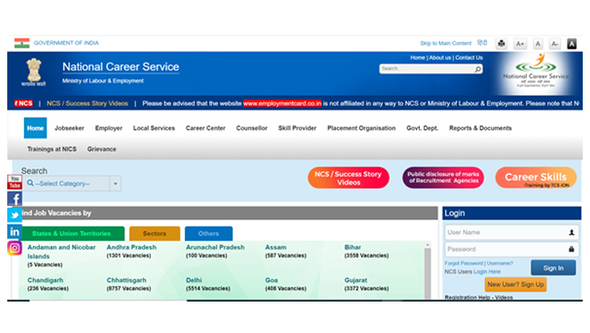

<!--StartFragment-->
 

Despite endless challenges and agonies, one positive direction that the pandemic 2020 accelerated was the heightened interest towards work from home jobs.

In the entire 2020, individuals lived with a fear of insecurities, job losses, and scrambled with [alternative ways of working](https://www.financialexpress.com/jobs/remote-working-to-boost-hybrid-workforce-gig-economy-in-2021-study/2167711/).

Corporate employees are working toward [hybrid and flexible models](https://gofloaters.com/teams/). The risen work from home job opportunities is attracting talents who have been in oblivion, employees who have lost job, individuals who want to earn passive income or workforces who do not wish to go back to[&#39;on-site&#39; roles](https://trak.in/tags/business/2020/12/15/work-from-home-improves-productivity-these-operations-can-become-permanent-wfh-jobs/) and want to continue to strike the [balance with work from home](https://gofloaters.com/blog/the-top-five-productivity-tools-for-freelancers/) jobs.

Below is a list of the 13 best [work from home jobs](https://gofloaters.com/blog/10-powerful-quotes-on-remote-working/) in India that pay you well, offer better [opportunities](https://www.cnbc.com/2021/01/11/flexjobs-top-companies-hiring-for-work-from-home-jobs-2021.html) for you, and a fresh start in 2021.

But before that, note that there are many websites, online portals, and mediums through which you can find your most well-suited work from home jobs. But before you take up opportunities, take precautions and be vigilant to [avoid scams](https://www.welivesecurity.com/2021/01/11/5-common-scams-how-avoid-them/) and fake WFH ads.

- [Remote Work – Leader](#remote-work--leader)
- [Virtual Assistant](#virtual-assistant)
- [Community Builder](#community-builder)
- [Bookkeeping](#bookkeeping)
- [Transcription](#transcription)
- [Affiliate Marketing](#affiliate-marketing)
- [Data Specialist](#data-specialist)
- [Website Geek](#website-geek)
- [Digital Marketing Geek](#digital-marketing-geek)
- [Social Media Manager](#social-media-manager)
- [Business Storyteller](#business-storytellers)
- [Editing – Videos & Audio](#editing---videos-and-audio)
- [National Career Service](#work-from-home-jobs-by-national-career-service)

### **Remote Work – Leader:**

Number 1 in my list is the growing need for a Remote Work Manager, Remote Work Leader.

Whatever may be the designation or the title for the role, organisations today need a person who understands what it takes to lead a [remote team,](https://gofloaters.com/blog/how-we-built-our-healthy-remote-start-up/) a remote organization, and install the remote-first practices.

Remote Work - Leader is the most important job role going above and beyond the roles of HR professionals. This particularly attracts those who have vast experience and capability in leading and nurturing teams across geographies and times zones in a 100% [work from anywhere](https://gofloaters.com/blog/gofloaters-workation/) or remote set-up. This is a new role, so the remuneration can be anything from a $40 to 1000s depending on the necessity of the organisation.

Key Skills:

- Understanding and proficiency in Remote-First Laws &amp; Systems expertise
- HR Generalist
- Team Management
- Performance Management

### **Virtual Assistant:**

A popular and one of the smartest job roles is <a href="https://www.upwork.com/hire/virtual-assistants/" target="_blank"  rel="noreferrer">Virtual Assistant</a>.

Virtual Assistant is the role of a location independent executive assistant with varied experiences. In short, jack of all trades; someone who would be the single point of contact for the CEO/Founder or the Corporate Leader.

A self-motivated person with the right virtual skills across multi-discipline is the most wanted. Virtual Assistant in a remote role can earn anything upward of $10 per hour to $50 per hour.

Key Skills:

- Administrative
- Organisation
- Social Media
- CRM
- Customer Service

### **Community Builder**

Building an outstanding community is a skill, is an art.

Building a network of loyalists, followers, and customers is a huge, long-run investment that brands across the spectrum are discovering like never.

Exceptional brands like OnePlus, Apple, Starbucks, Harley Davidson, Disney, Airbnb, Lego, Red Bull are built by getting the customers to fall in love and build a relationship with a brand.

A role of a community builder will be to establish, grow, and nurture the community through collaborative opportunities and platforms. The remote

Key Skills:

- Community Management
- Content Development
- Social Media
- Event Management
- Customer Performance Management
- Brand Management

### **Bookkeeping**

If you have amazing digital organisation skills, then this is an interesting work from home job for you. The role of a <a href="https://www.easybooksapp.com/blog/bookkeeping-for-beginners-basic-concepts-to-get-you-started" target="_blank"  rel="noreferrer">bookkeeper</a> is to ensure recording, organising, classifications and report generation of all workflows and financial transactions made by the business for any accounting or filing purposes.

You may not be a CA, an Accountant or a CPA, but you must gain or master accounting tools, systems. If you are a good fit in a remote role, you may earn anything from $10 to $40.

This role is popular in the west but is now gaining importance with growing remote businesses.

Key Skills: Communication, Accounting Tools Competency, Accounting Report Writing.

### **Transcription**

Apps, automation, and machines are great. They help ease manual labour and quick actions. But one feature that still needs human touch is the Voice (only audio or video) to Text.

At a personal level, I have explored many voices to text or transcribing tools –paid and unpaid. Nothing gives a more satisfactory output than the one by humans. The reasons may be many – the accent, the grammar, the right words. To get a meaningful conversation right, a lot still look for <a href="https://www.upwork.com/freelance-jobs/transcription/" target="_blank"  rel="noreferrer">transcribing freelancers</a>. In a remote role, you can earn anywhere between $10 - $30 per hour

Psst: I freelanced and earned from transcribing and translation projects and earned about $5 per hour. I kinda find it exciting to listen to newer thoughts!

Key Skills:

- Communication skill
- Language competency
- Respective language writing skills
- Accurate &amp; fast typing

### **Affiliate Marketing**

One of the topmost works from home jobs include <a href="https://neilpatel.com/what-is-affiliate-marketing/" target="_blank"  rel="noreferrer">Affiliate Marketing</a>. India may not yet have seen the endless possibilities. If you get the hang of it, this is one of the most rewarding streams with no any investments and thousands of marketers across the globe.

<a href="http://www.smartpassiveincome.com/affiliate-marketing-strategies/" target="_blank"  rel="noreferrer">Pat Flynn&#39;s Smart Passive Income</a>

Affiliate marketing is the process of earning a commission by promoting other people&#39;s (or company&#39;s) products. You find a product you like, promote it to others and earn a piece of the profit for each sale that you make.

Key Skills:

- General Sales &amp; Marketing
- Technical skills including all the online media buying pricing models like the CPM, CPC, CPI, CPA, CPL, CPS, and business development

### **Data Specialist**

If you have good with data, analytics, reasoning capabilities and if your core is Maths &amp; Science, then data specialist is a go to work from home job profile. A range of roles vary under <a href="https://www.zippia.com/data-specialist-jobs/" target="_blank"  rel="noreferrer">'data specialist'</a> but the job requires you to solve business problems through numerical data and sources.

Key Skills:

- Soft Skills
- Technical skills including MS Office, ML, AI, Mining &amp; Querying Language, Scripting Language, Statistical Language

### **Website Geek**

Online, internet and websites have now become an integral part of our lives. A website developer, designer is one of the popular needs of today with [rising start-ups](https://gofloaters.com/blog/registering-your-startup-in-startup-india-scheme-procedure-and-benefits/). While kids are learning to code and create visual canvases online if you have programming and create skills, Website development, UI, UX designing is your go to role.

Key Skills:

- Verbal and written communication skills
- Technical Skill including HTML, CSS, JAVA framework, testing, debugging, developer consoles, web performance tools

### **Digital Marketing Geek**

Like the &#39;Everyone Loves Raymond&#39;, everyone loves &#39;Digital Marketing specialist&#39;. If you are not skilled, it&#39;s time to brush up on the digital media knowledge and create a niche for yourself. Social media manager is one of the most sought-after job roles. But being a [digital media](https://brainstation.io/career-guides/how-to-become-a-digital-marketer) specialist, who is a director sorts who brings together all things digital to achieve organisation goals is one of the most wanted job profiles.

Key Skills: Marketing, SEO, SMM, Media Analytics, Ad Campaign, Campaign Management, Internal Comms, Communications.

### **Social Media Manager**

You may find it hard to become a Digital Marketing Geek but being a social media manager is the present tense of knowing how to work on MS Office. Social Media management has become one of the most critical skills of job today. From an executive to CEO, today professionals are encouraged to know-how about social media. And if this can become your career, there can be nothing more credible. From creating and producing engaging and creative copies to marketing the content, a social media manager is essential to any business- small to large.

This is one of the popular <a href="https://www.iamexpat.de/career/employment-news/top-trending-future-proof-jobs-2021" target="_blank"  rel="noreferrer">work-from-home jobs</a> especially because of it can be 100% location independent.

Key Skills: Being organised, best in communications, experience in marketing, creative and strategic understanding, expertise in relevant social media tools

### **Business Storytellers**

The role of a business storyteller involves creating insightful, engaging content for different stakeholders. This can range as visual content, textual/ written content, video, or video copies. The role can be for both internal and external audience depending on the needs.

Key Skills: Communications, English proficiency, knowledge of other languages, content management and marketing knowledge, MS office and other business tools required for creating content.

### **Editing - Videos and Audio**

2020 taught us how to appreciate life. But 2020 also gave a lot of opportunities online. And escalating need for [video and audio content](https://gofloaters.com/blog/5-must-listen-remote-work-podcasts-in-2020/) fosters the need for audio-visual editing skills.

Well, a lot of individuals, influencers and businesses are looking out for extra hands who can conceptualise, produce, and edit audio and video content. Remote roles for editing allow you to earn $5 to $30+ dollars depending on your expertise.

Long format content, short format for Instagram, YouTube, Twitter or Tik Tok or promotional/ad/campaign video and audio skills are the next &#39;in&#39; thing.

Key Skills: Communications, Scripting, trained in image/ audio/ video tools (Adobe Creative Suite, Premiere Pro etc), graphics designing. SEO and SMM knowledge are an added advantage.

### **Work from home jobs by National Career Service**

The Government of India under its Labour Department has been hosting career opportunities in Government as well private sector through is immensely resource portal <a href="https://www.ncs.gov.in/" target="_blank"  rel="noreferrer">National Career Service Project</a> (NCS).

Skills: Multi-skills opportunities for <a href="https://www.ncs.gov.in/_layouts/15/ncsp/successstoryvideos.aspx" target="_blank" rel="noreferrer">private and government</a> jobs.

<!--EndFragment-->
