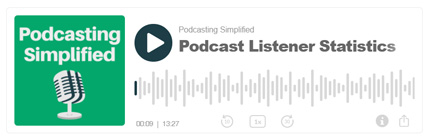
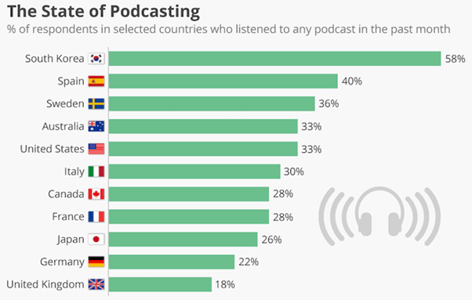
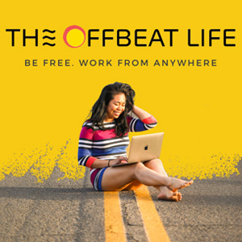
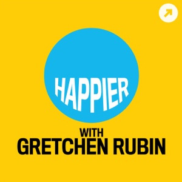
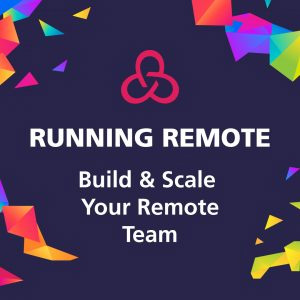

<!--StartFragment-->

 

Some of our favourite and recommended list of new-age podcasts about Remote Work

The growth of podcast listenership across the globe has been peaking, especially since the lockdown. Quality and fresh contents have increased the demand for listenership. To double are the innumerable localized, regional content that is streaming across the channels.

Given its popularity and benefits that podcasts bring to your thoughts and learning, in this article we want to share with you 5 <a href="https://gofloaters.com/blog/tags/remote-work/">remote working</a> podcasts which have unique perspectives.

<h2 style="color:#4f9fc8; font-weight:bold;">Podcast in India</h2>

Podcasts have been into existence since 2000s. However, it was in 2005 when podcast officially arrived in India with Indicast by Abhishek Kumar and Aditya Mhatre being recognised by the iTunes. Since then, there has been an exponential growth of this new medium, and edutainment excellence is matchless. From fiction conversations to real-life experiences of entrepreneurs and companies, podcasts have been a significant source of entertainment for different audiences and segments.

<h2 style="color:#4f9fc8; font-weight:bold;">Why should you listen</h2>

NO! we are not saying you are free, but we are recommending you a list, so you learn and unlearn novel ways of thinking. Here are 3 solid reasons why you should listen to podcasts:

1) **Convenience:** You could listen to the podcasts while washing the dishes, driving or walking around the park or just relaxing after an eventful day. There isn’t a need to worry about missing out on the visual or losing the text content.

2) **Its Free:** Most platforms offer podcast for free unless you are looking for a premium service.

3) **Knowledge everywhere:** One can never replace knowledge of book reading, but podcasts are a substantial source of learning if you are too busy to read a book.

Global Fact: South Korea leads the world in the percentage of people who have listened to a podcast in the past month with 58%.

 

<b>Courtest:</b> Podcast Insights

 
 
<h2 style="color:#4f9fc8; font-weight:bold;">5 must listen</h2>

Amongst million list of podcasts and 1000’s dedicated to business, entrepreneurship, start-ups and remote work conversations here is our definitive list of the most interesting remote working podcast that you should definitely listen!

  

<h4 style="color:#141414; font-weight:bold;">Remotely Inclined</h4>
The podcast is hosted by <b>Stefan Palios</b>. Best known for his fresh, new, and unique viewpoints about different the topics. The topics of discussion are broken down in the most easily digestible format. Remotely Inclined interviews leaders and entrepreneurs from remote businesses on different topics concerning

<b>Listen:</b> <a href="https://remotelyinclined.substack.com/" target="_blank" rel="nofollow">https://remotelyinclined.substack.com/</a>

<b>One of thee recent favourite episodes:</b> <a href="https://remotelyinclined.substack.com/p/this-startup-is-turning-high-school" target="_blank" rel="nofollow">https://remotelyinclined.substack.com/p/this-startup-is-turning-high-school</a>

  

<h4 style="color:#141414; font-weight:bold;">The Remote CEO Show</h4>
The Remote CEO Show is hosted by <b>Deniero B</b>. This podcast brings out the best for freelancers and independent professional. In discussion with the guests, host helps you understand and discuss everything remote – from team management to driving your freelancing passion, Remotely. For all those who are looking for practical and actionable thoughts and ideas for remote work. This is an inspiration. 

<b>Listen:</b> <a href="https://www.denierob.com/up-your-game/" target="_blank" rel="nofollow">https://www.denierob.com/up-your-game/</a>

<b>One of thee recent favourite episodes:</b> **Remote work secrets with Frank Cottle**

  

<h4 style="color:#141414; font-weight:bold;">The Offbeat Life</h4>
Hosted by <b>Debbie Arcangeles</b>, the offbeat life is a result of Debbie’s personal experiences. She encourages people to share their passion and lead a life without a 9 to 5 grind. A must listen to get inspired, live the best life and be location independent. 

<b>Listen:</b> <a href="https://www.theoffbeatlife.com/podcasts/" target="_blank" rel="nofollow">https://www.theoffbeatlife.com/podcasts/</a>

<b>One of thee recent favourite episodes:</b> <a href="https://www.theoffbeatlife.com/episodes/remote-creative-director/" target="_blank" rel="nofollow">https://www.theoffbeatlife.com/episodes/remote-creative-director/</a> 

  

<h4 style="color:#141414; font-weight:bold;">Happier with Gretchen Rubin</h4>
Hosted by <b>Gretchen Rubin</b>, this podcast listening to this podcast will help you find answers to a lot of remote work woes. Gretchen Rubin is one of the most sought after influential for personal and professional happiness subjects. Combined with her personal experiences and stories she discusses wisdom about work, happiness, and life.

<b>Listen:</b> <a href="https://gretchenrubin.com/podcasts/" target="_blank" rel="nofollow">https://gretchenrubin.com/podcasts/</a>

<b>One of thee recent favourite episodes:</b> <a href="https://gretchenrubin.com/podcast-episode/291-get-out-of-storage-unit" target="_blank" rel="nofollow">https://gretchenrubin.com/podcast-episode/291-get-out-of-storage-unit</a>

  

<h4 style="color:#141414; font-weight:bold;">Running Remote Podcast</h4>
If we are talking remote podcast, we ought to list the master of all podcasts, Running Remote Podcast. This podcast is the produced by the largest remote conference makers – Running Remote. An inspirational podcast that helps learn from the experiences of guests from different businesses and industry on running remote operations and managements.

<b>Listen:</b> <a href="https://runningremote.com/remote-work-podcast/" target="_blank" rel="nofollow">https://runningremote.com/remote-work-podcast/</a>

Listen to its recent episode : <a href="https://runningremote.libsyn.com/sharon-koifman-founder-distantjob" target="_blank" rel="nofollow">https://runningremote.libsyn.com/sharon-koifman-founder-distantjob</a>

 
If you enjoyed this blog, like and share. Don’t forget to share your most favourite podcast list. 

<!--EndFragment-->
