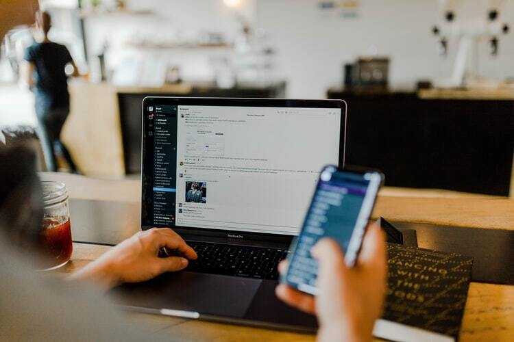
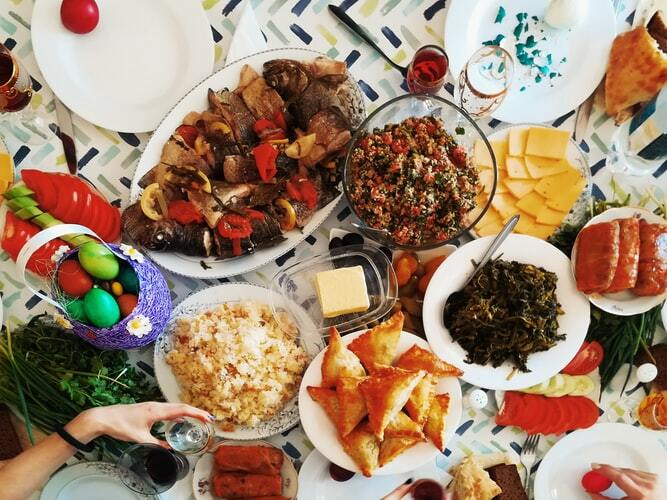

<!--StartFragment-->

 <h2 style="color:#4f9fc8; font-weight:bold;">Simple ways for work-life balance</h3>
<h3>The official beginning of the festive season</h3>

Come October and it's the official start of the festive season in India. We mark October to December as the most propitious months with celebrations, partying, and social gatherings. Despite the pandemic giving us surprises and shock waves, festivities and festive breaks never cease to have a dull moment, and nor will our homes.

2020 will be a stark contrast to the usual festive moments we have enjoyed over the years. Most of us had an 8-hour, we could take excuses and take leaves for the occasion. A lot of us preferred the office environment even during these times, as it appeared to be more sorted. 

With remote working in complete evolution, the million-dollar question is how we are going to manage the work-from-home remote working. Remote workforces will have to be extra careful and draw the lines between personal and professional worlds. 

In the current scenario, even the most seasonedremote worker can stay distracted because of the infectious Indian festive spirits, especially now that we are <em>'at home'</em>, overwhelming domesticities, and responsibilities. 

In this article, we will chart out 6 actions that will drive successful remote working even during the festive season.

 
<h4 style="color:#4f9fc8; font-weight:bold;">Discuss at home the need to have 'Work-time'</h4>

It begins from a discussion table. Unless you raise the importance of the subject, no one wouldcare. Discuss with your family about your availability and non-availability. Plan and talk about it in advance, so that the family plans the celebrations accordingly and you aren't dragged out of your remote meetings. These allocated schedules will benefit in relishing both worlds during the festive season andnot bog down to any pressures. Stick to the schedules and click off the festivities in <em>great spirits.</em>

 
<h4 style="color:#4f9fc8; font-weight:bold;">Mentally Ready</h4> 

A <a href="https://www.wsj.com/articles/the-science-behind-wfh-dressing-for-zoom-11600626704">recent research</a> proves dressing like a usual work day helps in getting the focus at work. Researches have studied that brain, clothing, productivity relates to improving individual performance, and team morale. Imagine yourself on a video call with your pajamas and sleepy head! You need not be <em>suited</em> up, but wear comfortable and presentable clothes that create the aura of a professional set-up. In today's world, virtual appearance is important.

 
<h4 style="color:#4f9fc8; font-weight:bold;">Find your space</h4> 
The average size of an Indian urban home is 650-700 sq-ft. Imagine the struggle you might undergo to WFH on a normal day. In a recent survey by leading <a href="gofloaters.com">co-working</a> space provider Awfis, <a href="https://economictimes.indiatimes.com/jobs/working-from-home-saves-rs-5520-per-month-for-an-average-professional-in-india/articleshow/77850500.cms" target="_blank" rel="nofollow">74% of the respondents</a> are willing to work remotely, which could be home or a cafe near home. Finding a coworking space near you could help you save your time, be productive, and stay. Or lock yourself in your home offices to give undivided attention and wrap up your tasks for the day as early as possible. Focussed work helps improve quality and productivity.

  

  
<h4 style="color:#4f9fc8; font-weight:bold;">Eat well, Eat Right</h4>
Temptations are endless during festivities. But if you are working from home, you need to binge a little lesser. We agree, one cannever avoid festive and holiday binge eating, but we suggest you could avoid: 

Too sugary food & beverages 

<ul>
<li>Spicy & irritant foods </li>
<li>Unhealthy, untimely snacking </li>
</ul>

  

  

Don't skip eating, hydrate well, portion your meals and keep the healthy snacksin reach. These are the best ways to overcome over indulges. 

Harmful eating habits can lead to fatigue,drowsiness, and heavy weights. Stick to your break schedules and follow a mealplan during the work timings. Stay Healthy – mentally & physically successful remote working, especially during festive and holiday seasons.

 
<h4 style="color:#4f9fc8; font-weight:bold;">S.M.A.R.T Goals</h4> 
Your personal <a href="https://www.briantracy.com/blog/personal-success/smart-goals/#what" target="_blank" rel="nofollow">SMART goals</a> will help you define your short-term objectives. If you cannot be organised in a remote setup, then the entire purpose of remote working is defeated. With freedom comes responsibility! What's cool if you keep shifting the dates in ASANA for the task deadline? 

Set yourself personal S.M.A.R.T Goals, it is indeed one of the most powerful way approach objectives. 

Specific – answer all your 5W's, draw clear and concise goals that help you achieve your purpose. 

Measurable – track your progress; you neither would want to overtime nor drown in the spirits of festivities without an action. 

Achievable – set challenging yet achievable goals.Don't over commit. I prefer under-promise, overachieve. 

Relevant – check your priorities. Festival seasons are to be enjoyed with great work-life balance, so make sure you set pertinent goals. 

Time Specific – We never have enough, be it any profession work plate is always full, but in this case make sure you attach goals that are time relevant and focus on important things that matter immediately.

 
 
<h4 style="color:#4f9fc8; font-weight:bold;">Be empathetic to your remote colleague</h4>

Everybody is under pressure with doubled efforts, deadlines being the last quarter of the year. A year that hasn't done much good. But in the mad rush, we must not forget to appreciate and be respectful of colleagues and team mates. Globally today's workforces are as distributed as possible. Keeping in mind the Indian context, the cultures and customs are far more unique and diverse. 

Utilize and appreciate the working and personal hours of your colleagues and yours. In the usual scenario, once you are out ofthe office, it is understood that you would not be available. But in the remote scenario, we take the extra edge and ask for extra time and favors. Unless itis an emergency, DND. 

Give your colleague their personal time and do not micro-manage while they are off duty. 

 
<h4 style="color:#4f9fc8; font-weight:bold;">Driving a positive environment</h4>

Festivities are seasons of sharing of joy and gifting. This is one of the crucial points. If you stay positive, the teamstays positive. One need not be a team manager, but just by sharing the positive vibes with in your team has a great impact. 

Take this chance to establish a never-before opportunity and build a relationship with your remote colleagues. Companies and managers can take this opportunity to give their employees coworking passes, gift hampers, send hand-written cards and letters. Try to make this year special. Create a virtual celebration schedule, host online parties, and appreciate your colleague's contribution. 

Finally, let nothing stop you from <em>acting on</em> your responsibilities, both personal and professional. Adding these approaches will make your remote work-life organized and let you enjoy both parts of the world.

 
<h4 style="color:#4f9fc8; font-weight:bold;">Before you check out of this page  <em>here is a last word<em></h4>

The COVID-19 Pandemic has been hard on all of us. The last 6+ months has been stressful, and we might have moment of self-doubt. May be this could be thebest time to take the time off, take a break from pressures and live the moment. So, don't be too hard on yourself, take the break and rise back with better enthusiasm to work. 

<a href="https://gofloaters.com/blog/tips-to-be-stay-happy-and-productive-working-remotely/">Click here</a> for more advice on finding more on making your life easy while <a href="https://gofloaters.com/blog/tips-to-be-stay-happy-and-productive-working-remotely/">working remotely</a>

Don't forget to read our recent blog on mental wellness <a href="https://gofloaters.com/blog/how-we-built-our-healthy-remote-start-up/">How We Built Our Healthy Remote Start-Up</a> 

**Recommended Reading**

<a href="https://gofloaters.com/blog/are-you-missing-your-office-days/"><em>Are you missing your office days?</em></a> 

<a href="https://gofloaters.com/blog/the-top-five-productivity-tools-for-freelancers/"><em>The Top 5 Productivity Tools for Freelancers</em></a> 

<a href="https://gofloaters.com/blog/are-you-missing-your-office-days/"><em>Elements of Effective Remote Team Meetings</em></a>

<!--EndFragment-->