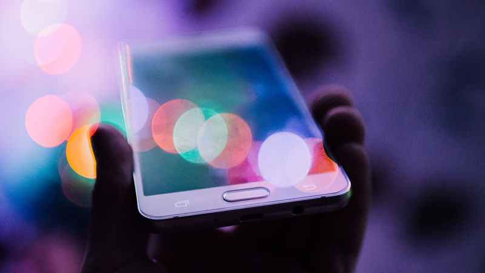
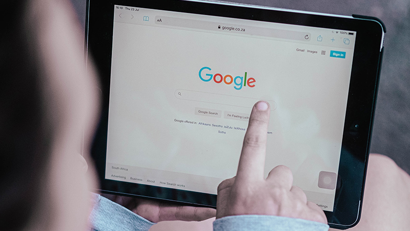
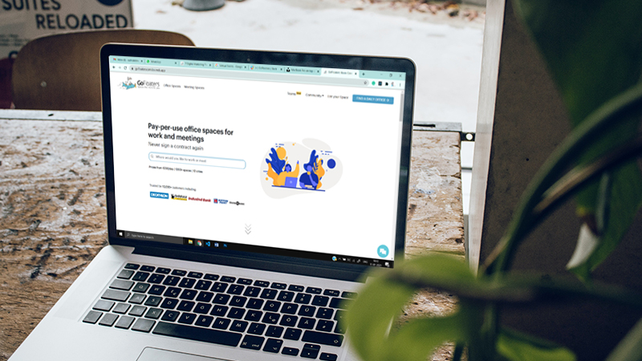
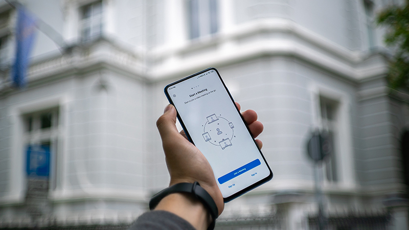
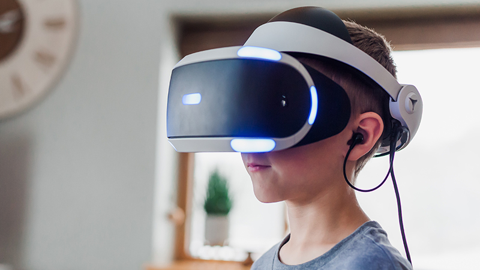

<!--StartFragment-->
 
2020 presented numerous challenges to the way we lived and the way we worked. But if there is one thing left to be learnt from the year that was, it is how 2020 has year has altered the future!

Sign up and find out why [10K+ customers trust GoFloaters](https://gofloaters.com/)

While the digital landscape has seen rapid growth and development over the decade, 2020 accelerated the changes in the way we market and influence. And many of these updated trends are here to stay though 2021! Here is our list of 7 of the major digital trends to watch out for in 2021…

- [Social Media](#social-media)
- [Virtual Events](#virtual-events)
- [Personalization](#personalization)
- [Google](#google)
- [Websites](#websites)
- [Web Apps](#web-apps)
- [AR & AI](##ar-ai)
- [Moving ahead in 2021](#moving-ahead-in-2021)

### **Social Media**

Over the last decade, social media has taken on the role of being more than just a way to keep in touch with friends. Powerhouses like Facebook and Instagram are now being used by retailers to connect with customers on multiple levels. Alongside Influencers, this provides brands with opportunities unlike any before.

 

Earlier used as a source for discovery, today platforms such as Instagram allow you to make purchases directly from advertisements. Retailers have already found a noticeable improvement in sales via social media, which is only aided through interactive content and video marketing.

Clearly, this is a trend that is expected to grow in the coming years.

### **Virtual Events**

Online meetings were not unheard of before 2020, but they have undoubtedly taken on a larger presence.

This year has seen most companies opt for platforms such as _zoom_ and _google meet_ to conduct meetings, and with time have also adopted these platforms to host larger events.

The feedback for this seems to be largely positive among employees and consumers, with many acknowledging the numerous benefits it provides in terms of time, and others citing that it also provides increased accessibility and while also benefiting company&#39;s ROI&#39;s.

### **Personalization**

Numerous business operations have gone digital, and marketing has not been left far behind. Digital marketing provides the opportunity to customize content. Without the limitations of print marketing, a large number of companies have opted to run smaller customer-specific campaigns, resulting in 25% click-through, as opposed to larger untargeted efforts.

Some organizations have taken this a step further, with outfits such as Starbuck seeing a revenue increase by ensuring in-app personalization.

With numerous opportunities presenting itself in the digital space, personalization of content is definitely one that is expected to stay!

### **Google**

SEO, Smart bidding on ads and other features have made google an indispensable part of digital marketing. Going in 2021, we&#39;re sure to find google coming up with more ways to engage with customers, personalizing content along the way.

It&#39;s safe to say Google will remain the go to search engine to find information on companies and their products, and also one of the first points of interaction.

### **Websites**

The earliest digital presence, websites continue to remain an important marketing tool. Studies have found that newsletter signups via websites have greater response rates, especially when collected via push notifications.

Also, as the first point of contact, more businesses are paying attention to their website&#39;s design and ease of use and access, which not only helps with conversion rates but also helps create a brand identity that makes you stand out against competitors.

### **Web Apps**

Progressive web apps are a quickly growing trend. They provide an easy solution for businesses to skip over the complexities of creating custom apps for both android and iOS, Microsoft and Apple, while providing all the benefits in a singular space.

Web apps provide uses the added benefit of not having to download apps, freeing up storage space and creating a general ease of use and transferability.

These apps are quickly taking over design software&#39;s and could soon be used on a larger scale.

### **AR &amp; AI**

Immersive and intuitive tools such as AR and AI are changing the way we engage on websites and via apps.

 

Augmented Reality is slowly being introduced into various sectors, starting with numerous home décor and interior design apps, it was soon picked up by the beauty industry and other gaming apps. AR allows users to get a better idea of products they are looking to buy and has helped improve sale rates.

Artificial Intelligence is being increasingly used in websites and apps in the form of AI bots. They help answer queries and solve problems, that earlier required users to spend time searching for answers or wait in line for a customer representative.

### **Moving ahead in 2021**

There is a great sense of enthusiasm for 2021. Across the industries and vertical 2021 is a year of hope and optimism. In the last one year a lot has changed the way consumers make their decisions. It is time that will decide what trend is going to make or break in 2021.

What is your digital marketing choice?

<!--EndFragment-->
