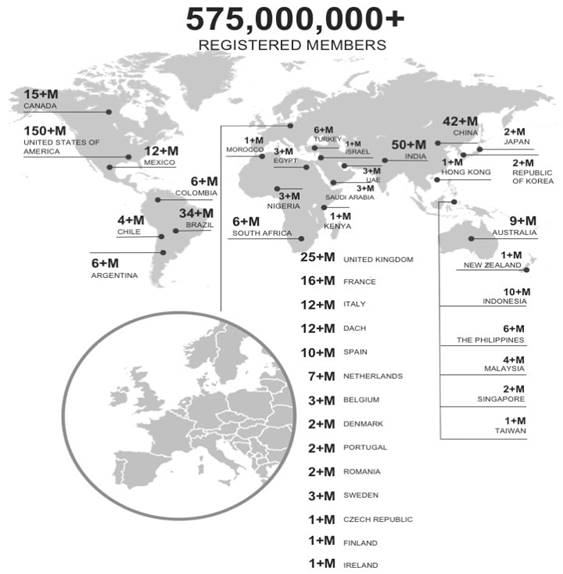

<!--StartFragment-->
Practical tips to identify prospects & generate leads in any business scenario 

 

<a href="#fact">Facts about LinkedIn</a>

<a href="#leadgen">How to start with LinkedIN lead gen?</a>

<a href="#moving">Moving across 3rd degree connections</a>

<a href="#linkedintool">Useful LinkedIn tools</a>

  

**The holy grail for lead generation**

Identifying prospects, creating contacts, and building relationships is the key to converting potential leads into customers and numerous platforms provide opportunities for marketers in B2B leads generation.

 

Among the numerous platforms, a few specific ones used for B2B leads generations are listed above. 
But fret not, I'm here to speak on one unique platform named LinkedIn.

##Some amazing facts on LinkedIn
 
LinkedIn is a social networking platform that connects graduates, thought leaders, decision-makers, and executives with each other to share their experience, expand their network, and explore potential opportunities. 

**<em>The facts and figures are in millions.</em>**
Here are some more exciting facts about LinkedIn.

1. LinkedIn has  <a target="_blank" rel="nofollow" href="https://wearesocial.com/blog/2019/10/the-global-state-of-digital-in-october-2019">310 million monthly active users</a> and around  <a target="_blank" rel="nofollow" href="https://news.linkedin.com/about-us#statistics">670 million users</a> overall and every second  <a target="_blank" rel="nofollow" href="https://news.linkedin.com/about-us#statistics">2 new members</a> join LinkedIn.

2. Looking at the gender ratio,  <a target="_blank" rel="nofollow" href="https://wearesocial.com/blog/2019/10/the-global-state-of-digital-in-october-2019">57%</a> of users are males and the rest 43% are female users.

 

3. 24% of the overall users  <a target="_blank" rel="nofollow" href="https://datareportal.com/reports/digital-2019-global-digital-overview">are millennials</a> and the number stands at 87 million at present.

4. 63 million users on Linkedin are decision-makers (C-suite executives/ policymakers).

5. Out of 630 million users, <a target="_blank" rel="nofollow" href="https://business.linkedin.com/marketing-solutions/audience"> 90 million are senior-executives</a>, 3M are MBA graduates, 6M are IT decision-makers, and 17M are decision-makers.

80% of B2B leads from social media platforms come from LinkedIn. A research conducted by  <a target="_blank" rel="nofollow" href="https://blog.hubspot.com/blog/tabid/6307/bid/30030/LinkedIn-277-More-Effective-for-Lead-Generation-Than-Facebook-Twitter-New-Data.aspx">HubSpot</a> explains how LinkedIn helps marketers generate more leads than Facebook and Twitter combined.

##Where do I start on LinkedIn?
 As a sales professional, you have locked down on the platform but how do you find your clients? The answer lies in one of LinkedIn's features.

 **Sales Navigator**
 Sales navigator is a sales tool that connects sales professionals with potential prospects by narrowing down on the demographics, industry sector, and seniority level using its unique features and inmail them to promote/sell your product/service.

 
The sales navigator is one of the techniques of  <a target="_blank" rel="nofollow" href="https://en.wikipedia.org/wiki/Social_selling">social selling</a>, for building relationships with your potential buyers.

 **Narrowing down your potential leads**
 Sales navigator, used by premium users, is a tool for identifying &amp; narrowing the sectors your potential lead might belong to and connect with them.

 Here's a walkthrough on how to narrow down on your potential prospects.

 **1. Narrowing down on the geography:** The first step of the Sales Navigator tool is to narrow down on the geographical locations you want to target. 

**2. Narrowing down on the industry:** After choosing the location, the next step is to select the industry your clients might be a part of.

**3. Targeting company size:** The third step is to select the size of the organization you want to target. 

**4. Functions of your prospects:** This step helps you choose the functions of your client you want to target.

**5. Seniority Level:** This step helps you in selecting decision-makers as your potential clients.

Before the tool starts providing recommendations, it asks to save particular accounts based on the previous selections.
After pressing the start advanced search, this is what the page looks like.

The names projected on the list, are potential clients based on my previous selections.

As you can see from the image above, my potential buyers are second-degree connections. This means I can send them an invite but what do you do if most of your prospects don't have any common connections.

##How to move across third-degree connections?

 For a salesperson, a third-degree connection is a hindrance to reach out to his potential client. But there are several ways to move past it.

**1. Update your profile:** The initial step is to update your profile with all credentials, work experience, and a profile picture along with a caption that has proper keywords. For example, if you are a web designer, use a long-tail keyword by adding extra details like &lsquo;Professional web designer from New Delhi'.

**2. Connect with influencers:** Connect with influencers from the industry you are looking into. This is one of the reasons why the professionals in my list were second-degree connections since an influencer was a common connection to my potential clients.

**3. Connect with your colleagues:** When you join an organization it's important you connect with seasoned professionals in your industry. They might be a common connection to your potential buyer. 

Another important point for a sales professional is the intro note. While sending a note attached with your invite make sure you don't sell them right away. If you have a common connection, please don't send a note. Most professionals think you are trying to sell them something and might outright reject your request for connection.

Instead, connect with your potential lead and develop a relationship. See if they have a problem and ensure the product you provide is the solution to their problems. 

##Why do you need a Sales Navigator?

There are a lot of limitations to using LinkedIn which is overruled by Sales Navigator. The limitations in LinkedIn are as follows.

<ol style="padding-left:20px"><li> You cannot go beyond a specific number of pages on LinkedIn per day.</li>
<li> You cannot send requests beyond a certain limit to your second and third-degree connections.</li>
<li>  It doesn't provide you options like lead lists and follow-up lists to be on top of their updates.</li>
</ol>
Sales Navigator provides you with all these options and keeps you up-to-date regarding the news related to your clients.

**Add on tools**
There are Email scraping tools that may help you with social selling. Tools like  <a target="_blank" rel="nofollow" href="https://www.lusha.co/">Lusha</a> provide you with contact details of your potential leads. 

There are other sales software tools like  <a target="_blank" rel="nofollow" href="https://www.yesware.com/">Yesware</a> that helps you track users who have opened your emails.

**Bottomline**

Your competitors will also be familiar with these tools and your prospects would be getting 1000s of emails from your competitors making it crucial for you to stand out. Concentrate on small things. Endorse skills for your prospects this really makes a difference.

Follow up on your clients through the help of notifications. Wish them during their birthdays and congratulate them on their new promotion or job shift.

Subscribe to newsletters of your clients' organizations so you can use that information to provide a solution.

Remember that these are tough times, so don't blatantly sell them your product and use emotional quotient while pitching your product/service.

Note: You can find the link to this detailed discussion  <a target="_blank" rel="nofollow" href="https://www.youtube.com/watch?v=-8VaAi0Qk6E&t=202s">**here**</a> 

<!--EndFragment-->
