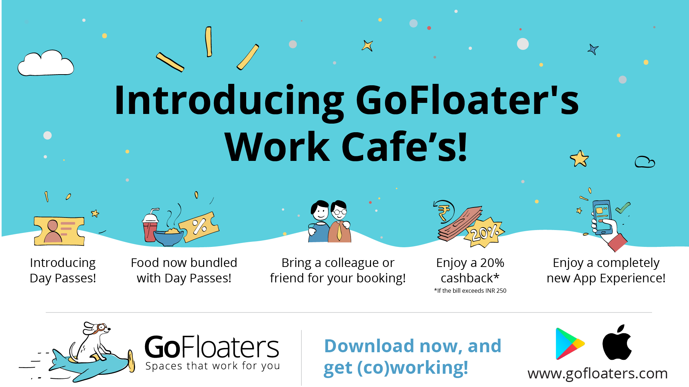
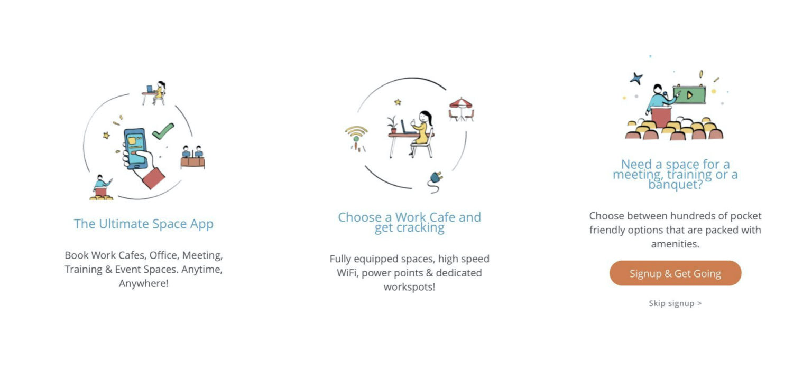
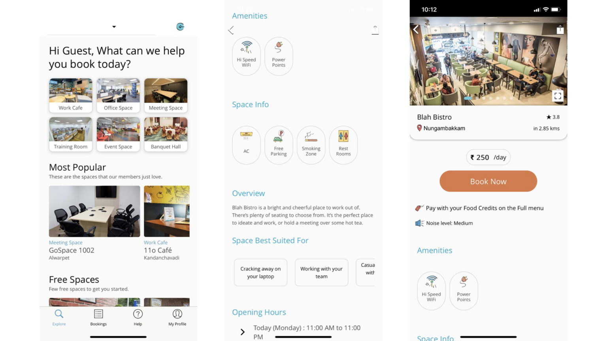

<!--StartFragment-->
When we launched GoFloaters two years back, we aimed to reinvent the way entrepreneurs, creators and freelancers worked. We believe that the traditional office space and work environment is not for everyone, hence we launched our platform as an on-demand coworking spaces, shared offices and meeting spaces provider. The need for a dynamic work environment is quite apparent as we are currently serving 10,000+ users in the four cities that we launched in: Chennai, Hyderabad, Bengaluru and Coimbatore.

**Making things easier**

Our design philosophy is "keep it simple". After speaking to hundreds of users across four cities, we understood that working out of coworking cares have left stomachs rumbling!

We hear you.

We also realized that since people were working long hours at our partnered cafes, we couldn’t expect them to keep spending money on food!

 

**The solution**

GoFloaters is proud to present Work Cafes! We have taken our existing model of cafe coworking and we have made it better. GoFloaters users can now use our coworking spaces and enjoy their favourite meals and beverages. Working on an empty stomach is never an option, and we get it, some days are hectic, and it’s not always possible to pack a lunch!

**What else is new?**

We have also completely reworked the way you pay for your space so you don’t have to keep worrying about topping up every hour, or booking a set number of hours in advance.

Here’s how it works:

* **Day Passes:** With the day passes you don’t have to worry about working a particular number of hours, because some days you will work longer than others. Our day passes are set at an affordable ₹250 and you get back ₹250 as food credits!

* **Food is now bundled with Day Passes:** With those food credits you can spend on food and beverage and enjoy an office for a day! We have found that this is the perfect solution for all you entrepreneurs waiting to make those smart savings!

* **Cashback on Food:** The fun doesn’t stop there! We have also incorporated a 20% cashback on all food expenditure above ₹250, which you can use during your next booking. Cashbacks are our way of saying thank you to our users and our partnered spaces. We want you to hustle, but not at the expense of your wallet getting lighter.

* **Bring a Colleague or Friend:** Sometimes the best work is done in a team, and we at GoFloaters understand that more than anyone. Convert your office space booking into a date for two. You could bring a colleague, a friend or even a potential client. All this for the price of ₹250. We’re trying to empower entrepreneurs to use our coworking spaces to meet clients as well. And now that we have 600+ spaces in our portfolio, it’s really quite easy for you to keep your meeting spaces fresh.

* **Enjoy a completely New App Experience:** Our coders, marketing teams, and head of design have an exciting new app experience in store for you! If you haven’t updated the GoFloaters app we do strongly recommend you doing it!

GoFloaters has a New Look!

 

GoFloaters App Screenshot - 1We are constantly thinking of ways to improve the lives of our users. Work can take up a lot of your time and if it does, we need to help you make your booking process easier. We have completely revamped the look of the app to highlight key information that is important to you, the user. As simple as three steps, you should be able to book your space, and ready to rumble.

 

We have introduced a Curated Collection of spaces where you find exactly what you need at the tap of a button! Have a puppy? Need a pet friendly work space? We have you covered! Are you a night owl? Need a space that is Open Late, well we got that covered too!

You can even help out other GoFloaters users by dropping a review of a space that you like! The more positive reviews, the more likely you are to meet a fellow GoFloater. But hey, that’s not all. We’re also adding a blog! This blog in fact! If you want to keep tabs on all our exciting networking events like 2019’s Be Your Own Boss then all you have to do is head on over to the Blog tab, and keep yourself informed.

We’re also offering special Event Spaces, Training Rooms and Banquet Halls (coming soon) in the new app. This is a great opportunity to run your corporate events, team building workshops and more.

What’s next?

At GoFloaters, we believe that the community is everything. Our secret team of engineers and experts are developing an exciting project called the Community HQ. This will be the one stop portal for all users! You’ll be able to like and share updates among the community, find like-minded freelancers, collaborate, find gigs, and even attend local events. Remote working and coworking will finally be a little less lonely and we can’t wait to empower and build a wonderful community of entrepreneurs, startups, freelancers and creators!

If you enjoy our blogs, don’t forget to sign up for our bi-monthly newsletter!

We wish you a happy work week!

Lots of love,

The GoFloaters Team

<!--EndFragment-->