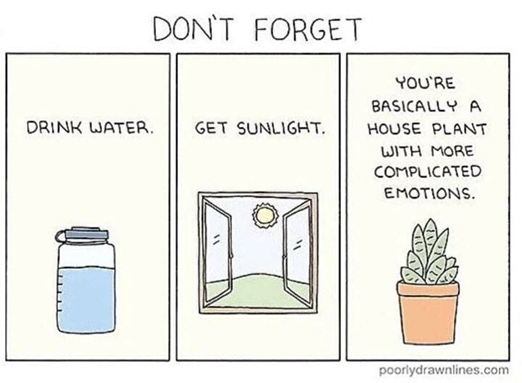
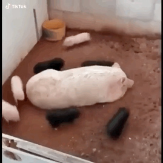
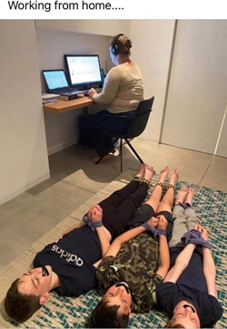
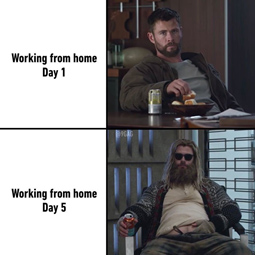
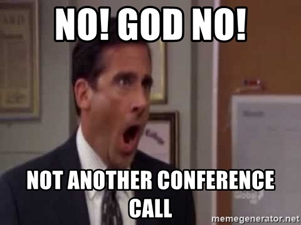
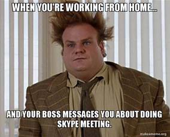
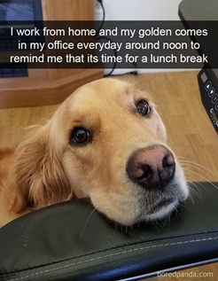
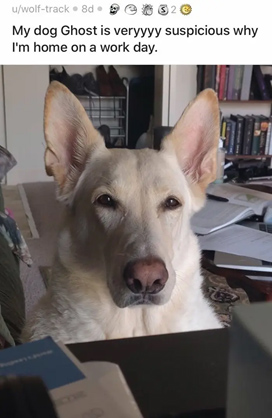

<!--StartFragment-->
 

Compartmentalization played a huge role in our daily lives pre-COVID times. Right now there's a blur between the personal and professional life, all thanks to the new work from home policy. With no time-bound restrictions, productivity has increased to an extent where organizations are planning to extend this policy post-pandemic.

With an increase in pressure, there's always people leaning on memes for some relief, either motivated enough to create them or just have a glimpse of a series of them.

Some of them are exaggerated bits of our activities while some can't be further from the truth (like the one above which for some reason is also my personal favorite).

The biggest challenge of working from home has always been the constant distractions around you. There's TV running, babysitting, household chores your mom has been asking you to do since morning, and the worst if you are a parent, your kids don't have school anymore. So you have to make them sit through the horrendous online classes and manage your boss's calls simultaneously. [You all are heroes].

**If &quot;When your kids don't have school for another 8 weeks and you've already given up&quot; had a meme.**

Source <a href="https://productcoalition.com/15-working-from-home-memes-to-brighten-up-your-day-da75634aa79" target="_blank"  rel="noreferrer">here</a>

**Although not a solution, some working mothers are considering it**

On top of all this, there are no dietary restrictions when you are in isolation. Lockdown has restricted any kind of physical activity, and lazy people are using it as another excuse to not flex once in a while. Personally, I think gym trainers and nutritionists will have tons of client offers once this lockdown is lifted, to help people shed all the weight they have gained over the past few months.

**Stress eating is real**

Remote working has made communication challenging to coworkers. They have to ensure deadlines are met on time, so they have to constantly be in touch to coordinate their work. The only way to be in touch is through video conferencing, calls, or through text messages. Also, people forgot grooming due to lockdown.

**Michael Scott can relate to frequent calls a lot I guess….**

**When your manager is judging your appearance real hard but you're just glad you made it to the meeting in your pajamas on time.**

People with pets are now facing new challenges. To manage the big fur of happiness can sometimes become hectic for pet owners. As much as they help beat stress and anxiety, they can be an element of distraction. I don't blame you. How can you resist not to play, when they show those puppy eyes? Not me!

**Source** <a href="https://www.boredpanda.com/funny-pics-dogs-snapchat/?media_id=1320697&amp;utm_source=in.pinterest&amp;utm_medium=referral&amp;utm_campaign=organic" target="_blank"  rel="noreferrer">here</a>

I remember when I was in my cousin's apartment. He owns a labrador named rocky. Rocky always watches his owner go to work. But due to lockdown, my cousin has to work from home and rocky got all suspicious and gave a look like &quot;Bro what is this behaviour?&quot; and the meme below is highly relatable.

**That's exactly how Rocky looked at my cousin.**

**Bottomline**

Jokes apart, work from home has its challenges. It is important to check on your mental health. Take those short breaks, don't go too hard on yourself. Catch up with your colleagues and old friends. Realize that even they are going through the same exact thing. Talk things out to them. You will be surprised by the level of relatability there is between you and them. Remember just like any other occurrence, this shall pass too.

**Source**   <a href="https://imgflip.com/i/1qst7s" target="_blank"  rel="noreferrer">here</a>

<!--EndFragment-->
