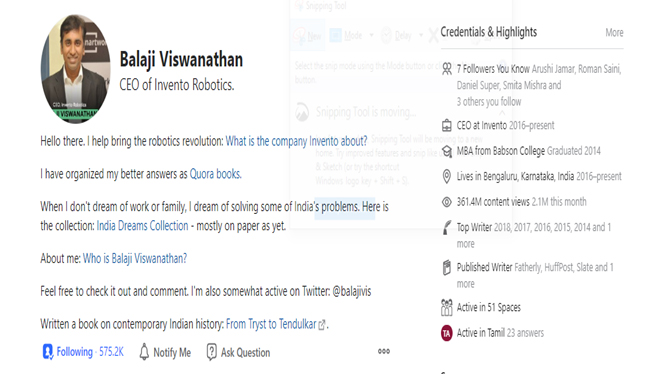
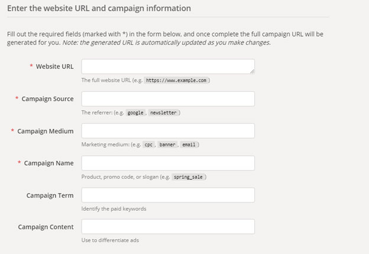
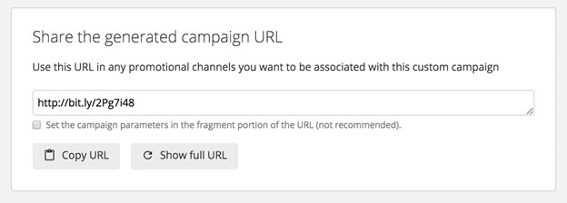
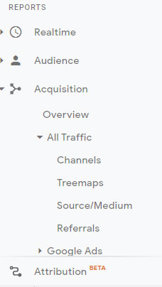
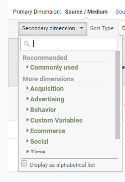
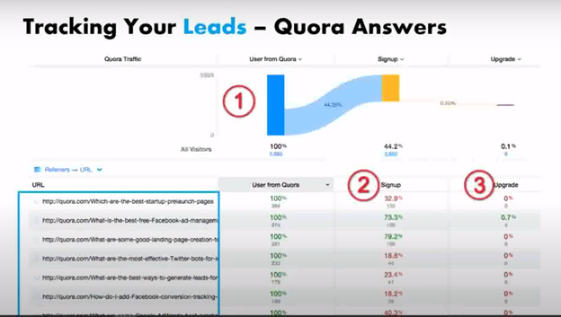

<!--StartFragment-->

 

<a href="#why">Why Choose Quora?</a>

<a href="#how">How to Quora generate leads?</a>

<a href="#what">What questions to pick in Quora?</a>

<a href="#best">What do best answer Quora questions?</a>

  

##Business and lead generation

In today’s day and age, there is a surge of new businesses, freelancers, and start-ups. This ultimately brings in heavy competition and the only way to survive is to attract potential customers or find leads who may be drawn towards our business model.

<a href="https://blog.hubspot.com/marketing/beginner-inbound-lead-generation-guide-ht">Lead generation</a> is an important aspect for any kind of business since they bring in customers and without customers any business is deemed to fail.

Now finding customers can be expensive. There are expenses to write content, design ads, track traction, and accordingly modifying the ad gets tedious and may sometimes not even bring in the desired footfall. 

What if I told you, there is a cost-effective way to target a niche segment and convert them into potential customers?

**Quora**

For those of you who are unaware, Quora is a platform where you can post questions, write answers, interact with people, and follow potential thought leaders. It is a social media platform but something that adds value to regular users and even business leaders.

##Why choose Quora?

You may ask “Why necessarily Quora when there are many other platforms?”. Well here are some solid reasons to support my stance on this particular platform.

1.	Quora attracts <a href="https://www.quora.com/q/quoraforbusiness/Reach-300-million-monthly-unique-visitors-on-Quora">300 million active users every month.</a>.
2.	The platform contains a diverse set of users ranging from professionals to freelancers.
3.	According to a <a href="https://go.quoraforbusiness.com/rs/384-CMP-465/images/B2B_Marketing_Guide_on_Quora.pdf">study conducted in 2017</a>, 54% of the adults earn $100000 annually which depicts a strong purchasing power among the users.
4.	An average user spends more than 4 minutes on a blog which most of the platforms struggle to bring.
5.	There are more than <a href="https://www.techwyse.com/blog/internet-marketing/quora-ads-the-ultimate-guide-for-beginners/"> 400000 topics in Quora</a> making it easier to find one's niche.

##How to generate leads?

Since we have chosen the platform, now comes the important aspect of how to generate leads. Here are a few steps to follow before approaching potential leads.

1.	Create a complete profile that contains all your personal and professional credentials like your current employer, your designation & hobbies. Any good writer who brings in a substantial amount of views has these aspects complete.

The above profile is of a renowned personality especially among the Quora community, <a href="https://www.quora.com/profile/%E0%AE%AA%E0%AE%BE%E0%AE%B2%E0%AE%BE%E0%AE%9C%E0%AE%BF-%E0%AE%B5%E0%AE%BF%E0%AE%B8%E0%AF%8D%E0%AE%B5%E0%AE%A8%E0%AE%BE%E0%AE%A4%E0%AE%A9%E0%AF%8D-Balaji-Viswanathan?q=balaj">Mr. Balaji Viswanathan</a>. By glancing through the credentials, you can see why this is one of the best examples of an updated profile.

2.	Ensure to write a two-line summary while answering questions. Users judge your credibility by reading your summary hence making it a crucial deciding factor for user engagement.
  

As you can see in the above image, the question is about entrepreneurship and it has been answered by an entrepreneur as you can see it in his summary which in-fact strengthens the credibility of the answer.

3.	Quora is all about bringing in value by narrating the knowledge-rich experience and providing in-depth analysis on a particular topic. Therefore, it is important to give something before expecting a return.

4.	Provide users with a substantial number of backlinks, videos, and articles that provide them the content they are seeking. 

##What questions to pick?

Before writing answers, it is important to find your niche among the 400000 odd classifications on the platform. While doing so, go for the topics you are most comfortable with and make sure to do well in that.
 

The following image is from a renowned Quora writer’s page, Roman Saini’s. He is the Co-founder of the learning app Unacademy. Now Mr. Roman has been an active user for more than 3 years, but his number of answers has just been 344.

He has been awarded as the top writer of 2017 and his content has attracted more than 25M views. This is because he focused solely on the questions, he was comfortable enough to respond in a well-structured manner. In brief, Mr. Roman found his niche. 

After finding your niche, it is important to find the most viewed articles & top writers in that niche. Understand their way of approach to a particular problem.

Here is a classic example of a question approached by a regular Quoran and a top writer.

<a href="https://www.quora.com/Is-it-better-to-be-obsessed-with-one-passion-or-to-be-obsessed-with-several-passions">**Is it better to be obsessed with one passion or to be obsessed with several passions?**</a>

In the above example, the top writer was Mr. Roman Saini. He started off by sharing his personal experience with a <a href="https://www.quora.com/profile/Roman-Saini/answers">friend who was an all-rounder</a> who had multiple passions. When the narration is personal, users get automatically hooked since the narration is emotional. 

Now let us look at an answer that could have been tweaked into something exciting but ended up sounding timid.

 

It is also extremely important to give a unique opinion since there is no one correct answer. Let us go back to the same question as mentioned above. Mr. Roman is not the only one with a high number of upvotes, in fact there are multiple writers who have contributed their own share of experience which gained traction to their content because they were unique.

##What is the best answer?

Answering questions is not that hard but providing solutions to questions that can bring in traction can be quite difficult, and it requires a lot of practice, patience & perseverance. Other than the 3Ps here are a few more things to keep in mind while answering questions from your niche.

1.	Answer the questions in a structured manner. In other words, approach the problem by breaking them down into multiple segments. This helps in creating engaging content.

2.	Creating a visually appealing content must be your top priority. Maintain a balance of limiting your images to the required amount. Excessive images make your content look like spam.

3.	While creating visually appealing content, make sure to give credit to images where it is due.

4.	Ensure the content is error-free with all the grammars and punctuations intact. 

5.	Mention your competitors since it provides your viewer with a 360-degree perspective on your business which in turn makes the viewers trust you more.

Here’s <a href="https://www.quora.com/profile/Shyam-Sundar-Nagarajan-1">an example</a> of a good answer that ticks almost all the aspects mentioned above.

**Tracking leads on Quora**

Coming to the last and the most crucial part of the section, tracking leads.
Google Analytics has provided an amazing feature called the campaign builder, which helps in tracking the user flow. In other words, it helps us find the path taken by the user from starting to the ending point.

Here is an image of the campaign builder.
 

In the website URL, paste the URL link of the blog which needs to be analyzed.
Type in Quora as the Campaign Source. Type in Questions inside the Campaign Medium box. Also do not forget to mention the question under the Campaign Name box. 
 
 

After completing the following steps, scroll below to click on the converted URL into a short link and then copy the link and paste it in your answer.

Once this is done go to the Google Analytics admin page (provided you have the access). Under the Acquisition page select secondary dimension as your source/medium. By doing so we get to know the sites from which you are getting traffic to your website.

 
Click on source/medium under All Traffic in the Acquisition 
 

Select secondary dimension under source/medium to get the user flow

Here is an example of the user flow given below. In the first URL, out of 100% of the viewers from Quora around 33% of them have signed up on the website.

**Being aware of pitfalls**

Every platform has its Dos and Don’ts. Quora as a platform advises its users to adhere by its strict guidelines. Here are a few tips to avoid yourself from such pitfalls.

1.	Quora is not Instagram: This is crucial to understand. Do not post personal pictures of yourself until it is necessary for your respective answers. Otherwise the Quora community will consider it as clickbait.

2.	Do not try to outsmart the algorithm: If answers are not approached correctly then the algorithm will push your answers back. Since it is all about providing value to the community, therefore indirect and unnecessary long answers will be pushed back.

3.	Avoid inconsistency: Try to answer at least one question a day. Responding to a question today and then answering another question 5 months later will prevent your profile from recognition.

4.	Do not be spammy: If you are visually representing your content, do not go and bombard your post with several pictures. This will make your post look like spam and will be pushed back.

5.	Do not repeat your answers: Avoid pasting the same answers for different questions since this might lead to Quora admin flagging your content.

6.	Do not do outlandish selling: Avoid to-the-face selling since such selling will only push away the users from your content but rather provide them value through your insights through in-depth analysis of the topic.

7.	Try to have fun: Occasionally try to write questions related to your hobbies since that will give you an all-round personality which will tend to draw the viewers towards you.

**Conclusion**

To generate leads it is important that you prioritize quality over quantity which is a pattern some of the top writers of the Quora community strictly abide by. Since writing 1000 answers with no particular insights is not going to do any good for you or the viewers.
 
You can always improve your existing answer if you can provide additional insights into the question by editing your pre-existing answer.

Always contribute to questions and even comment wherever possible. This in turn provides you with more recognition since you are adding value to the community.

Engage with users as much as possible and build relationships. Try getting in touch with them on LinkedIn. Building a network always strengthens the business.

Choose your channel wisely. It is important to understand which platform works well for your business. If it is B2C go for Instagram/Facebook but if you are looking to generate B2B leads, then Quora is definitely the place for you.

Note: You can find the link to this detailed discussion here

<!--EndFragment-->
