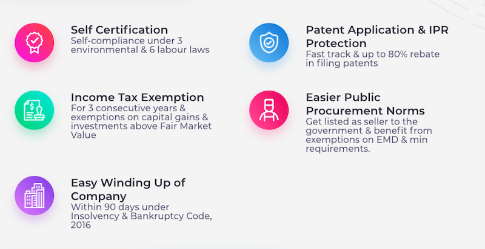
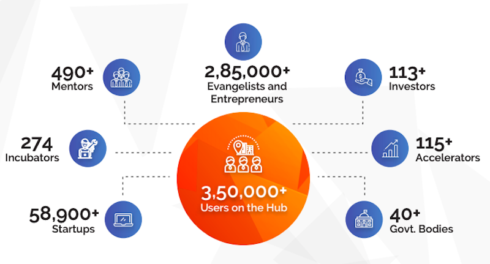

<!--StartFragment-->
 
Startup India Scheme was first announced by the Prime Minister Narendra Modi from the ramparts of the Red Fort on 15th Aug 2015. It was launched <a href="https://www.startupindia.gov.in/content/dam/invest-india/Templates/public/198117.pdf" target="_blank" rel="nofollow">officially</a> on 16th Jan 2016. Since then multiple initiatives have been launched under this scheme that have gone on to benefit 1000s of startups. Over 41,103 startups have registed in the Startup India Scheme as of this writing ⚡️ 
  

DPIIT also makes the list of recognized startups available <a href="https://www.startupindia.gov.in/content/dam/invest-india/Templates/public/Recognized%20Startups%20List_31072020.pdf" target="_blank" rel="nofollow">publicly</a>. (You can download and search for SMBSure Business Solutions. That's us GoFloaters 🙂 )
  
If you are thinking of starting up or already have a startup running, why should you care about the Startup India scheme? Are you eligible to register? Is it worth registering or not? What benefits can you gain from this scheme? These are some of the aspects that we will touch upon. 

- [What the Startup India Scheme is all about?](#what-the-startup-india-scheme-is-all-about)
- [Eligibility Criteria](#eligibility-criteria)
- [How to register to the Startup India Scheme?](#how-to-register-to-the-startup-india-scheme)
  - [Step 1 : Incorporate your company](#step-1--incorporate-your-company)
  - [Step 2 : Documents that you need to keep handy](#step-2--documents-that-you-need-to-keep-handy)
  - [Step 3 : Submitting the form](#step-3--submitting-the-form)
- [Benefits that startups can avail](#benefits-that-startups-can-avail)
- [What we can look forward to](#what-we-can-look-forward-to)

# What the Startup India Scheme is all about?

The Startup India Scheme was launched with the following three primary objectives :

1. Simplification and Handholding
2. Funding Support and Incentives
3. Industry-Academia Partnership and Incubation

DPIIT (Department for Promotion of Industry and Internal Trade) was given the responsibility to implement the scheme and coordinate with other govertment departments. 

Multiple other departments like the Department of Science and Technology (DST), Department of Bio-technology (DBT), Ministry of Human Resource Development (MHRD), Ministry of Labour and Employment, Ministry of Corporate Affairs (MCA) and NITI Aayog also agreed to chip in and make Startup India Scheme useful for startups.   
                        
# Eligibility Criteria
DPIIT has come out with specific criteria to define what kind of companies are eligible to register under the Startup India Scheme. Following are the criteria :

1. You should have already incorporated your company as a Private Limited company or an Registered Partnershup or a Limited Liability Partnership company
2. You company should be less that 10 years old (from the date of incorporation). This was initially kept as 7 years and now has been increased to 10 years. 
3. The annual turnover of the company should be less than Rs 100 Crores. At any point in time if your company crosses this limit then you are not eligible to drawn the benefits of the scheme. This limit at launch was kept as 25 Crores and has been increased to 100 Crores now. 
4. Your company should not have been formed by splitting up or reconstructing an already existing business
5. Your company must come up with innovative ideas and schemes. It shoudld have high potential of creating wealth and employment opportunities.

# How to register to the Startup India Scheme?

<a href="https://www.startupindia.gov.in/content/sih/en/home-page.html" target="_blank" rel="nofollow">Startup India Website</a> is the only place that you need to head to know about how to register, what benefits do you get from the scheme and much more. 

You can <a href="https://www.startupindia.gov.in/content/sih/en/startupgov/startup-recognition-page.html" target="_blank" rel="nofollow">register</a> for the Startup India recognition through a fairly straightforward online process. Here are the things that you need keep ready before you head to the portal to fill the registration form.  

## Step 1 : Incorporate your company

   As mentioned earlier your company should already be incorporated. If you have not incorporated, then you need to do that first. You may require an <a href="https://virtualoffice.gofloaters.com/" target="_blank">virtual office</a> to get the necessary documents to register your company.  

## Step 2 : Documents that you need to keep handy

 

1. **Recommendation letter** : When the scheme was initially launched this was not a requirement. Subsequently this has been added as a mandatory requirement. The scheme also outlays what kind of recommendation letters are accepted. 
   1. The letter can be from an incubator that is run by a post-graduate institution or 
   2. The letter can be from an incubator that Government of India funds as part of any specified scheme to promote innovation or
   3. A letter of funding not less than 20% in equity, by an Incubation Fund, Private Equity Fund, Angel Fund, Accelerator, Private Equity Fund, registered with SEBI that endorses the innovative nature of business or
   4. A recommendation letter from the Central or any State Government of India or
   5. A patent filed and published in the Journal of Indian Patent office in areas affiliated with the nature of the business being promoted.
    
   Kindly note that there is a prescribed format for the recommendation letter by DPIIT. You need to use thar format.
  

2. **Company incoporation document** : If you are a Private Limited Company or a Limited Liability Partnership company then you need the Certificate of Inorporation (COI). If you are a Partnership firm then you need the Registration Certificate. 
  

3. **PAN Card** of your business. 
  

4. **Other information about your startup** : The registration form also asks for other information like IP / Patents, awards that you may have won, funding you might have raised, what problem you are solving etc.   

## Step 3 : Submitting the form

 
Keep all the things mentioned in the previous step ready before you start the process. If you have all the stuff ready then the process of filling out the form should take 15 to 20 mins for you.   

Once you have filled the content and uploaded all the documents your job is done. Your information is reviewed by the team and you would get an acceptance communication through email. The time it takes to get the registration number is unpredicable. Some have reported to get the registration accepted in 24 hours and for some others it has taken a week.   

What you get after your registration is accepted is a DPIIT number (which was previously called DIPP number). Once you get this in the email then you can claim that your startup is Startup India recognized startup 💥   

You also get a "Certificate of Recognition" in the email. This PDF document confirms that your startups has been accepted as an eligible startup for the benefits. Keep this document safe as many entities need this document for you to claim the benefits.   

If you have misplaced it, sweat not! You can always <a href="https://www.startupindia.gov.in/content/sih/en/startupgov/validate-startup-recognition.html" target="_blank" rel="nofollow">download</a> this certificate from the Startup India website. 

# Benefits that startups can avail

 The Startup India lists all the benefits that you can gain from being a Startup India recognised startup. Here is a screen grab from the website that gives you a snapshot of the benefits. 

 

Here are the top 5 benefits that you get from the government:

 

1. **80 IAC Tax Exemption** : You may apply for Tax exemption under section 80 IAC of the Income Tax Act. Post getting clearance for Tax exemption, the Startup can avail tax holiday for 3 consecutive financial years out of its first ten years since incorporation. (TIP : Dont apply for this immediately when your revenue is going to be low in the initial years. Wait out for a few years and apply for this exemption as soon as you see yourself making significant profits.)

 

2. **Angel Tax Exemption** : Some of you may remember the huge furore that happened when the government introduced Angel Tax. This put off the investors in a huge way. Thankfully the government listened and brought in a provision to exempt the startups from Angel tax. If you are approaching investors for Angel funding then please do get your startup recognized by Startup India. 

 

3. **Patent Application Fast Tracking & Rebates** : If you have a reason to protect your IP with a patent then you have some help. The applications get not only fast tracked if you are a recognised startup, you also get 80% rebate on the government filing fees for a patent. 

 

4. **Self-certification** : You can self-certify your startup to be compliant with 3 labor laws and 6 environment laws. For applicable startups this should reduce the process overhead involved in doing a lot of paper work to get these clearances otherwise. 

 

5. **Easy Winding Up** : Starting up was always easy but winding a company down in India was a huge pain and time taking process. The government has recognized the fact that the failure rates of startups are going to be higher than tranditional businesses. Hence they have simplified the process and reduced the during to 90 days under the insolvency and bankruptcy act. 

 

6. **Easier public procurement norms** : If your startup is building a product or a service that government departments are a potential customer for the you are in for some good news. The government has made it it easier for recognised startups to participate in the public procurement process and allow them to access another potential market for their products. 

 

7. **Other government benefits** : Apart from these benefits from the government there are other government benefits too to get your startup recognised under Startup India scheme. You can read more about these beenfits [here](https://www.startupindia.gov.in/content/sih/en/government-schemes.html)

The benefits dont stop with just government schemes. Here are a few more : 

1. Certain banks provide recognised startups with balance free accounts. Some of the banks also give preferrential terms on loans. 
2. Some Incubators & accelerators provide higher weightage to recognised startups
3. Higher weightage is give to startups for grants by DST and MEITY  

# What we can look forward to
The Statup India website also has become a hub of startup networking and activities. 

Startup India also keeps launching contests and events that you can leverage to gain visibility and access to funding and mentorship. As of this writing the <a href="https://www.startupindia.gov.in/awards" target="_blank" rel="nofollow">National Startup Awards 2021</a> is open for applications. 

We can certainly look forward to more new invitiatives and amendments to existing ones that will be in favor of startups. 

******

GoFloaters has been helping 1000s of freelancers and startups with their flexible office space requirement over the last 3 years. We are committed to providing affordable spaces on a pay-per-use model so thar you get to have an office when you and where you want. 

<a href="https://gofloaters.com/teams" target="_blank" rel="nofollow">GoFloaters for Teams</a> helps teams embrace work from anywhere. It provides your team with a single pass to access over 1400 locations across 14 cities when you want. You get charged only when you use a space. 

<!--EndFragment-->
