<!--StartFragment-->

The concept of offices has changed over the years. Think about it, your grandfather would have spent his whole working life in the same corner office; your mother would have sat at the same functional cubicle for years; and then there’s your first job, that might have involved an office with more comforts than your home—a fully stocked pantry, pods to nap in, a gym— basically designed to keep you at work for longer hours.

Now, there’s a shift again when it comes to how we work and where we work. Our hours are not fixed anymore and thanks to technology we can work anywhere and at any time. Regular offices are slowly becoming obsolete and it doesn’t help their case that real estate prices are rising and traffic is becoming worse in our cities. No wonder, more people are choosing to work remotely and many companies are even encouraging it.

### WORK FROM HOME

Are you one of those many people who have the option of working remotely? Well, then you know while the idea is great and you avoid the hassle of traffic, working from home isn’t always the ideal option. There are just too many distractions and too many interruptions. Also, there’s the real risk of taking a nap on your comfy bed rather than staying productive. You’re only human after all! This is where coworking spaces come in and save the day (and your job)!

**_A coworking space is a convenient spot where you can find a seat, plug in your laptop and get your work done. This space could be a café, a restaurant or even a shared office or a hot desk._** (Note: Some people even consider meeting spaces, conference rooms, training and event halls, which you can rent by the hour, as being a part of coworking spaces.)

### IS A COWORKING SPACE ONLY FOR REMOTE WORKERS?

Nope! A coworking space works (pun intended) for everyone. No more is it the domain of a struggling freelancer sitting at a café to access the free Wi-Fi, but spending a small fortune on coffee and baked goods. Now, whether you’re a freelancer or a graphic designer, part of a startup or a salesperson, an entrepreneur or a consultant, there’s a coworking space for you. (And you don’t even have to order that cup of tea or croissant if you don’t want to!)

If your job has flexible timings, if you work on the move, if you need a pocket-friendly work spot, then a coworking space is for you!

### THE COWORKING BOOM!

Plenty of people in India are looking for convenient and affordable work spots and many are flocking to coworking spaces. This hasn’t escaped the notice of corporates and realtors. This piece in [LiveMint](https://www.livemint.com/companies/news/coworking-office-space-the-emerging-spot-for-investors-1557294746878.html) says that flexible working spaces saw a 277% increase in the first quarter of 2019.

And according to [The Economic Times](https://economictimes.indiatimes.com/industry/services/property-/-cstruction/office-space-leasing-by-co-working-players-rises-42-per-cent-to-4-mn-sq-ft-in-jan-junknight-frank/articleshow/70214644.cms) coworking companies have leased at least 4 million sq. ft. across eight major cities in the country in the first half of 2019. Not only that, plenty of established businesses are renting out their unused office spaces to startups and small companies. When footfall is slow, cafés and restaurants are inviting folks to come and work out of their establishments for a nominal fee.

You’re probably thinking, wow! That’s a lot of coworking spaces. Trust me, there are enough people to fill the seats. Don’t believe me?

Take a look at these facts:

- 1 in every 4 freelancers worldwide is from India
- India is home to more than 20,000 startups and with more mushrooming up
- Not only that, but [India’s](https://www.financialexpress.com/economy/indias-millennial-generation-bigger-than-china-to-boost-nations-workforce-to-worlds-largest-by-2027/836248/) millennial generation is larger than China’s or the US’s

All these folks need a spot to work out of and coworking spaces meet their exact requirements!

### WHAT'S THE APPEAL

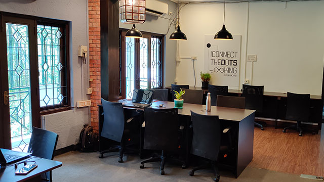

1. **Affordability:** I’ll begin with the main attraction of coworking spaces, which is affordability, before going on to the others. This is a point that’s going to come up often in this piece—real estate is expensive in Indian cities nowadays. But with coworking spaces, you can rent a shared office or find a seat at a busy and much sought after neighbourhood of the city without breaking the bank. With coworking cafés and restaurants, you only pay for the hours you use the space. And when it comes to shared offices you pay month-on-month, also there’s no hefty deposit. You also don’t have to spend money on doing up the space and paying maintenance—so you make some major financial savings.

2) **Flexibility:** Now onto the other benefits, coworking spaces also offer freedom, flexibility, and foster productivity. Let me elaborate. As I said earlier, thanks to technology we can work anywhere and at any time. All you need is Wi-Fi and a laptop. Are you a parent who wants to work near your child’s school? Would you like your office for the day to be in the neighbourhood where you have meetings all day so that you avoid being stuck in traffic during your commute? Do you only need a desk to work out of post-lunch? Coworking spaces offer you the **flexibility** to drop in and work whenever and wherever you need.

3. **Freedom:** This means **freedom**! While there’s the more basic freedom of where to work, when to work, whom to work with, and what work to do—all of which coworking spaces are good for. There are more specific freedoms based on your profession. As a freelancer, you’ll have the freedom to make your own hours and the ability to achieve a work-life balance. If you’re building a business by using a coworking café or a shared office you’ll have the freedom to divert energy and money into growing your company, rather than using it up on rent and maintenance of a traditional office. If you’re a sales representative or a consultant who’s on the move constantly, with a coworking space you have the freedom to pick your office for the day based on convenience and accessibility.

4) **Productivity:** Finally, you have **fostering productivity**! There are studies that show compared to regular offices there’s a vibe and feeling of community in a coworking café or a shared office space. **Riddhi Sharma** from [All For Sport](https://www.allforsport.in/) says, “Coworking spaces gives me a sense of community, which is much needed if you are working at a startup. You get to interact and learn from people with varied kinds of experiences. It gives me a boost in productivity and creativity when it comes to my work.” When you’re in a coworking space all around you people are working away, ideating and even brainstorming. This energy and camaraderie definitely increases your productivity. If you want to know more, check out this piece in [Harvard Business Review](https://hbr.org/2015/05/why-people-thrive-in-coworking-spaces).

5. **Avoiding Traffic:** But let’s not miss this point Riddhi brings up, which is one of the major reasons coworking spaces are becoming so popular. She says, “A major benefit of coworking spaces is avoiding traffic, because I get to work from a space which is close to my home and I save on the commute time.”

### DIFFERENT TYPES OF COWORKING SPACES

So, by now you know that coworking spaces are awesome and are the ideal choice to work from. But what are the types of spaces you have out there? You’ll need this information to pick the right one for you!

**Coworking cafés and restaurants**

First off, you have cafés and restaurants you can work out of. You’ll be guaranteed a seat, Wi-Fi and plug point, so all you have to do is find a coworking café or restaurant near you, drop in and get your work done. GoFloaters plug alert: But with us, you can book this space by the hour!

Obviously, since it’s a café/restaurant, there’s food and drinks on hand if you need some fuel to power through your workload. Oh, and there’s absolutely no compulsion to order (if you’re with GoFloaters).

**Shared offices**

This is usually part of a commercial property, where the proprietor rents out unused office space to multiple individuals or small businesses. The cool part of a shared office is that you’ll have access to a host of amenities. There are shared offices that come jam-packed with amenities—everything from printers and copiers to whiteboard and pantry.

**[Dr. Sridevi Rao](https://www.linkedin.com/in/sridevi-rao-b925167)** is a landscape architect who is all for coworking spaces. She says, “The affordability, locations and flexibility are the most attractive aspects of GoFloaters coworking spaces. Thanks to coworking spaces professionals from the design professions need not own or rent office space to set up a firm.”

Many of these shared offices even have a meeting room or private cabin attached. She says, “Even client and vendor meetings, especially for graduates starting out in the design profession, need not be tied down by place and commute.”

Pay attention to this bit cause it’s important: there’s no contract or down payment when it comes to shared offices. So you pay only month-on-month and can pick up and move whenever needed.

**Meeting and Event Spaces**

Okay, so this might not strictly come under coworking spaces. But I’m going to stick meeting and event spaces in here because we have some super cool spaces in this category for you—everything from conference rooms and training halls to boardrooms and event halls.

Forget about having your next event at a hotel or resort. Think coworking spaces instead.

**Suresh Babu**, Founder and CEO of [Web Marketing Academy, bengaluru](https://www.webmarketingacademy.in/), has something to say about this, “We’d planned a Digital Transformation and Corporate training for leaders of Decathlon Sports India, bengaluru. It was a 4-day workshop and we arranged it in a resort. Unfortunately, it was a total disaster, on the first day we realized there was no proper Wi-Fi, charging stations, whiteboards, and projectors.”

So, Suresh and his team decided to change the location to a coworking space instead.

“We quickly found a co-working place close to the city and booked it for the next three days. And the experience was amazing. We had access to high-speed Wi-Fi, projectors, and refreshments.” He also adds that, “The participants felt energetic and motivated in the space.”

Not only that during the break he met a person from his alumni who started his own company out of the very same coworking space.

### COWORKING CAFÉ OR SHARED OFFICE?

So, you have coworking cafés and restaurants and shared offices, which are the main types of coworking spaces. But what works for whom? And what are the benefits? Let’s break it down.

To better illustrate my point, I’m going to use some examples of coworking cafés we have in a particular part of Bengaluru. So please forgive the blatant self-promotion of GoFloaters.

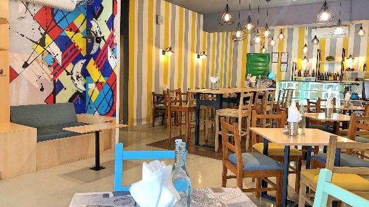

1. First, we have [Banoffee Café](https://app.gofloaters.com/#/home/explore/spacedetail/-LkAeC5H6N44Tz76ibbG) in HSR Layout, it’s bright and colourful, there’s lots of light and it’s conveniently located. In a coworking café or restaurant like this, you’re guaranteed a dedicated space to work, Wi-Fi and plug points. This is ideal for a freelancer or a salesperson between meetings who can drop in to get some work done. This space isn’t too formal; you could even have a casual meeting or interview here. You pay by the hour and there’s good food and drink available, which is always a plus. The cool thing about coworking cafés and restaurants is that each space has a different energy and mood.

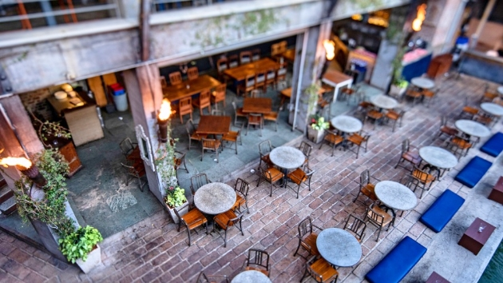

2. If you want to combine work and pleasure you could try a brewery like [Big Brewski Brewing Company](https://app.gofloaters.com/#/home/explore/spacedetail/-Lpc4D0-sH990dzHr1FK) in Sarjapur, where you can sit outdoors and have a beer or two while you work away or take a meeting.

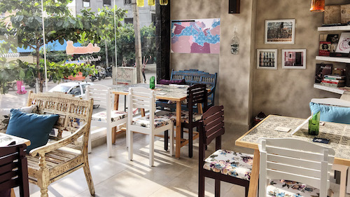

3. On the other hand, if you want some peace and quiet to focus you could pop into [Grapevine Café](https://app.gofloaters.com/#/home/explore/spacedetail/-LTWH_stK1c-26RNHgwE) in HSR Layout and work without being bothered, in a comfortable and atmospheric setting.

When it comes to shared offices—for the sake of continuity I’ll stick to the spaces we have in Bengaluru—there’s a formality and professionalism that comes with the spot.

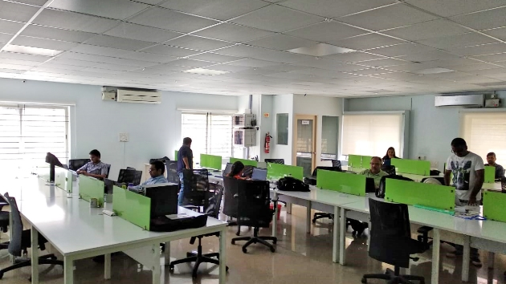

See [this shared office](https://app.gofloaters.com/#/home/explore/spacedetail/-Lp42qPviTCXEU5DCzro) at [Gatelength Tech](https://app.gofloaters.com/#/home/explore/spacedetail/-LfJV94rf2BZ7IS75cm6) in HSR Layout, there’s a cubicle set up which means there is some sense of privacy and you can come here with your team and get work done. You also pay for the space month-on-month, so there’s no long-term commitment. It also comes with amenities like a projector and whiteboard among others. Also, there’s free onsite parking that your coworkers will definitely appreciate!

For a startup or small team working together, a shared office may be better suited than a coworking café. And you can network and build a community with others sharing the space.

### HOW TO CHOOSE THE RIGHT COWORKING SPACE FOR YOU?

1. **Team size:** Depending on if you work alone or with a team, you can decide on the type of coworking space you need. For a startup or a small business, a shared office might make more sense. But for a salesperson or a freelancer, a hotdesk or a coworking café is a better bet.

2) **Frequency of meetings, presentations, interviews:** Will your small business have to meet with clients or make presentations often? Is your startup growing and interviews are a common occurrence? Then think about getting a coworking space like a shared office where there’s a conference room or training hall on the premises.

3. **Type of work:** What you’re working on can play a role in the kind of coworking space you choose. If you’re working on something sensitive, you might need a private cabin where security is guaranteed. If your field is more creative, you’d enjoy working out of an inspiring and fun space like a well-designed coworking café or a laid-back shared office.

4) **Budget:** One of the awesome things about a coworking space is its affordability. You could work out of a spot at an upscale part of town and not pay a fortune. Decide on a location that’s convenient and accessible to you (and your team).

5. **Location, location, location:** Location is important for another reason as well. In most cities, traffic is a nightmare and you don’t want a long commute between work and home. Pick a coworking space that is conveniently situated so you avoid spending more time on the road than at the office.

6) **Amenities:** What do you require out of your coworking space? Will just a seat and Wi-Fi do? Are there other amenities you’re looking at? Such as onsite parking and a pantry or even equipment such as a scanner and printer on hand. Pick a spot based on your and your team’s needs.

7. **Timings:** Few of us work 9-5 jobs anymore. You might be a freelance graphic designer who finds inspiration only in the evenings. Or your startup might have clients abroad, which means work happens early in the morning. When you decide on a coworking space, make sure it’s open at the time you need it!

### NEXT-LEVEL COWORKING SPACES

When you rent your own office space there’s a lot to keep in mind. After spending a fortune on down payment and then rent every month, you’ll have to shell out, even more, to do up the space, fill it with all the necessary equipment and utilities, and manage the maintenance as well. Thankfully with coworking spaces, you can find the work spot of your dream ready and waiting for you.

**Design Matters**

A well-designed space with natural lighting goes a long way in making you feel productive. There are lovely coworking spots where space and volume (architect term!) are utilised well, there are touches of greenery and functional yet stylish dedicated workspaces that make working a pleasure. And I would be remiss if I didn’t bring attention to some of the coworking spaces we have listed which are high on design.

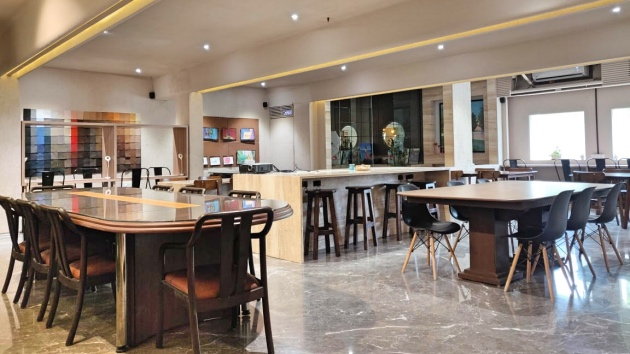

Check out [this space](https://app.gofloaters.com/#/home/explore/spacedetail/-LhA1n0j7jjaOCztBCRp) in the popular locale of Nungambakkam, Chennai. It has 2 person workstations, hotdesks, and dedicated workspaces as well. Everything from the layout to décor is top-notch. Who wouldn’t want to work out of here?

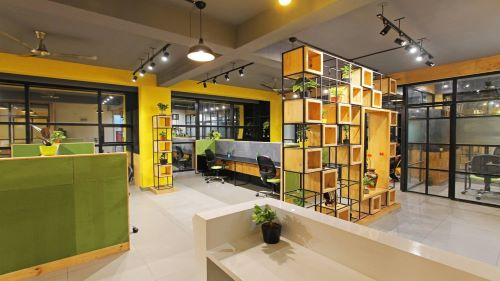

In Bengaluru we have some amazing coworking spots, but [this one](https://app.gofloaters.com/#/home/explore/spacedetail/-Le1LLjd0N74044YI0eo) in JP Nagar is particularly bright and welcoming with its yellow walls, potted plants, and well laid out spaces. There’s also a training room and conference room on hand, which is always a bonus. When you enter this space, you feel ready to work and get on with your day.

**Comfortable furniture**

We spend hours sitting at a desk typing away, so that chair better be ergonomic and offer support. And a good chair is not cheap! But there are some coworking spaces that pay attention to the furniture and aim to make sure it’s all ergonomic and make to work for hours out of. After all, if your workspace is comfortable, you’ll definitely spend more time there and be a regular.

**Amenities Available**

If you have a small business or are a person who has to make a lot of presentations, you need access to a bunch of equipment—think whiteboard, projector, and printer among others. These things cost money. So, it’s a major bonus when you find a coworking space that comes fully equipped with all the stuff you need.

**Location is key!**

Renting an office space in a prime location is sure to impress your customers and clients. But it will be a major drain on your bank balance. But with a coworking café or shared office, you can find a great spot to work from at a location of your choice and the best part you aren’t tied to it. So, if the need arises you can pick up and move onto another location.

**Fantastic facilities**

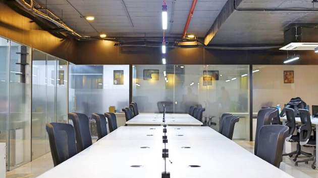

If you drive a vehicle you know how hard it is to get a parking spot. So when a coworking space offers free onsite parking, you’re not going to let that spot go! When it comes to awesome facilities this shared office in Hitech City, Hyderabad ticks all the right boxes. Not only is it conveniently located in the IT hub of the city, but it’s also close to the Metro station. There’s a meeting room on hand, onsite parking and coffee and tea available among other extra perks. So, from a fully stocked pantry to a recreation room, or even a pet-friendly work spot there are tons of coworking spaces that offer some great facilities. Did I mention free parking, already?!

**Sustenance on demand**

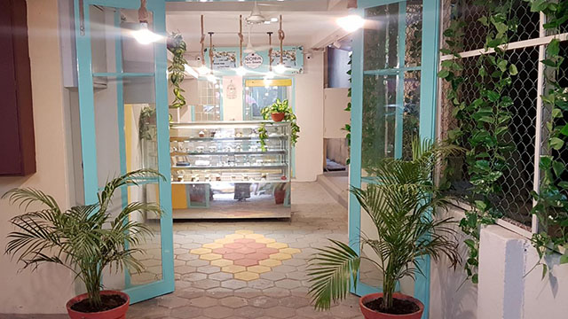

Coworking cafés and restaurants have some great food on offer. While there’s no compulsion to order, it always helps knowing there’s a delicious sweet treat on hand when you’re working out of [Café Adoniya](https://app.gofloaters.com/#/home/explore/spacedetail/-LjG6hbugMOOtdq0P_aU), Chennai. Added to that the décor is pretty and reminds you of something out of a storybook.

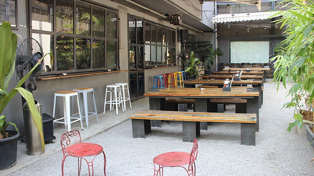

If you’re in Hyderabad, have a mug of freshly brewed beer while you create away at [Zero40](https://app.gofloaters.com/#/home/explore/spacedetail/-LdhMejvgSyicgdNidIr). This space is large, rustic and welcoming. It definitely makes for a great spot to chill out and work from.

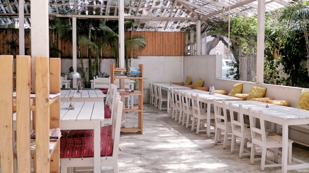

You could also chow down on some healthy brain food at [Yogisthaan Café](https://app.gofloaters.com/#/home/explore/spacedetail/-LTiJSGvryQOFdlh4hwx), Bengaluru to keep you productive. And the zen vibes of the space, and the peaceful ambiance combined with the quiet allows you to think and ideate.

**Community vibe**

You aren’t struggling and working alone in a coworking space. There’s a spirit and energy that is conducive to networking and inspires creativity and productivity.

**[Amit Nagpal, Ph.D.](https://www.linkedin.com/in/amitnagpalstoryteller/)**, of [Bloggers Alliance](http://www.bloggersalliance.org/), says, “Coworking spaces not only provide a working space at low costs for freelancers, startups, and solopreneurs but also fulfill the human need to socialise.’ He adds, “Entrepreneurship is a roller coaster ride and frustrations and feeling low is common. In such moments relationships developed with other entrepreneurs can be an emotional support system.”

### HOW DOES A COWORKING SPACE HELP YOU?

Now that you’ve read about all the types of coworking spaces that are available and what great facilities plenty of them offer. Let’s get down to the crux—what do you get out of a coworking space? So, whether you’re a freelancer or an entrepreneur or even own a startup or small business, you come out winning when you choose to work out of a coworking spot.

**Are you a freelancer?**

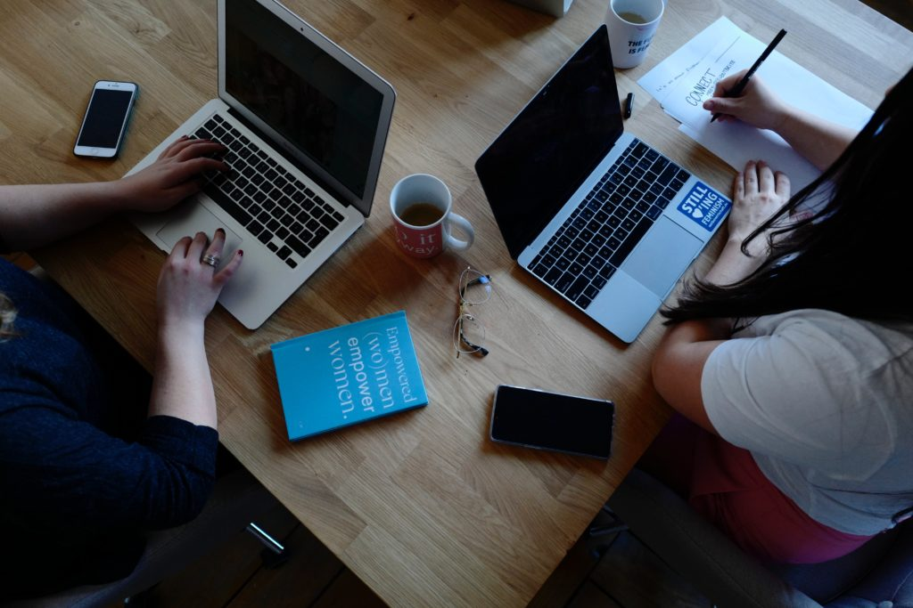

India is home to 1 in 4 freelancers worldwide as I mentioned earlier in this piece. And if you’re one of them, you want a nice, quiet spot to work from where you’ll have a dedicated seat and W-Fi—a coworking café or restaurant is just for you. As a freelancer, you make your own hours and you like to keep things flexible. So, with a coworking space, you’re guaranteed a work spot for whenever you need.

1. **Work from anywhere:** The great thing about a coworking space is that you can pick a location that’s convenient to you based on your schedule for the day. Whether it’s a coffee shop near your child’s school where you can work till it’s pick up time, or a restaurant near your client’s office where you can tick off some tasks before your meeting starts.

2) **Set a routine:** Being a freelancer requires a lot of discipline; you have to go after jobs and set aside specific hours to focus and work. Working from home isn’t always motivating and conducive to productivity. But when you get out of the house and book yourself into a coworking space a certain routine is established into your day. You’ll be in a better frame of mind to get cracking. And it always helps to be around others and see people around you working. Not to mention when a coworking café or restaurant is your office for the day there’s yummy food and drink available.

3. **Financial flexibility:** Coworking cafés and restaurants come in every price range. So you can pick a coworking space that not only suits your work vibe but also your budget. You could drop in at a laid-back café to get into the creative zone and be inspired to work. Or you might prefer a more formal restaurant where you can focus. Whichever space you use, you only pay for the hours you use it.

**Are you an entrepreneur/consultant?**

Being an entrepreneur comes with loads of responsibility, your schedule is not fixed, you’ll be in and out of meetings, and you’ll have to make important decisions—phew! There’s a lot riding on your shoulders. So, you need to focus all your energy and resources towards building your business.

You’re definitely going to need a space where you can work and plan and even meet with clients and investors.

So why go with a coworking space rather than a regular office?

1. **Value your location:** Do you want your office at an impressive address to wow your clients? That’s going to set you back quite a bit, not only the rent there will also be heavy deposits involved. But by going with a shared office at the location of your choice, you get the address you want and you save money—win-win!

2) **Overhead headache (or overheadache!):** When you have your own office there’s a lot of expenditure of money and energy involved. You’ll have to buy furniture and amenities, keep a check on the utility bills, and hire staff to maintain the space. But with a coworking space, all that is taken care of. You just have to plug-and-play. Headache over.

3. **Dynamic lifestyle:** When you have your own business no two days are alike. You’ll have a day filled with meetings some days and another day you’ll be tied to your desk. So paying rent for a regular office makes no sense. You are better off dropping into a coworking space as and when needed and getting your work done.

4) **Present yourself:** A major part of being an entrepreneur is meeting clients and investors. So, you’ll definitely need a space where you can hold these conferences and make presentations. Many shared offices come with fully equipped conference and training rooms. All you have to do is show up and wow your audience!

**Do you have a startup?**

India is a country of startups, there’s no denying that. Globally, bengaluru is ranked third for the launch of tech-startups in particular (with Silicon Valley and London being one and two) according to this piece in [The Times of India](https://timesofindia.indiatimes.com/city/bengaluru/firm-footing-bengaluru-is-still-indias-technology-startup-capital/articleshow/71089577.cms). People are constantly coming together to ideate, innovate and create. But an idea doesn’t turn into profit overnight. And while your startup needs a space to work out of, a regular office may be out of reach financially. Well, thank god for coworking spaces!

1. **The fiscal, the flexible, and the facilities:** Shared offices are affordable and come with Wi-Fi and seating and many even have amenities like printer and scanner among others. So, your startup doesn’t have to spend on high rent and buying equipment. Instead, that money can be used towards hiring talent and growing the business. Another awesome aspect of a shared office is that you only pay month-on-month. So, you can pick up and move whenever you need to.

2) **Distributed teams, remote working:** Your team and you might be sitting at different parts of the city or even country, in this case, using a coworking space like a coworking café or a restaurant or even a hotdesk makes loads of sense. They can drop into one at a convenient location and get their work done. Not only that, they’ll avoid spending long hours commuting!

3. **Confer, collaborate, chat:** If your startup has to showcase their product to investors or have a training session for employees, there’s a space for that as well. Some shared offices have conference rooms and training halls on the premises or you can even rent a standalone one by the hour. The spaces come fully equipped so you don’t have to worry about bringing anything but your presentation with you.

4) **Community connection:** There’s also that sense of community in a coworking space that your team and you will definitely be inspired and be productive. You don’t have to just take our word on this.

Om Thoke is the Founder of [Webfosys](http://www.webfosys.com/) and [Bloggers.World](https://Bloggers.World) and feels coworking spaces provide a great plug-n-play solution to startups and SMEs.

“_Webfosys used to operate from a coworking space at Golden Square several years ago, and it enabled me to network with many startup owners and grow my business quickly,_” says Om.

“_I also came across interesting startup ideas at these coworking places and they’re a great place for bloggers/entrepreneurs to find cofounders/mentors/investors/fresh talent to recruit._”

Om now supports coworking by offering free incubation to promising startups at his own offices in bengaluru.

### THE DRAWBACKS OF COWORKING SPACES

This wouldn’t be a well-rounded piece if I didn’t touch upon the negatives of coworking spaces.

- Security and Privacy: If you’re working with sensitive material or on top-secret innovations, a coworking space might not offer you all the privacy you need.
- No set roles and titles: In a traditional company there’s a certain hierarchy and set jobs for specific roles. This gets blurred when a startup or small business works out of a coworking space. People take on multiple jobs and responsibilities. And corporate culture can take a hit.

But in all honesty I can say that these are very minor drawbacks and ones for which solutions will be found in the near future thanks to the development of new technology and apps to ensure privacy and ease while working.

There’s also a change happening in the way we work and our ideas of what an office should be like—no longer are we hung up on corporate culture and titles.

### THE #FUTUREOFWORK

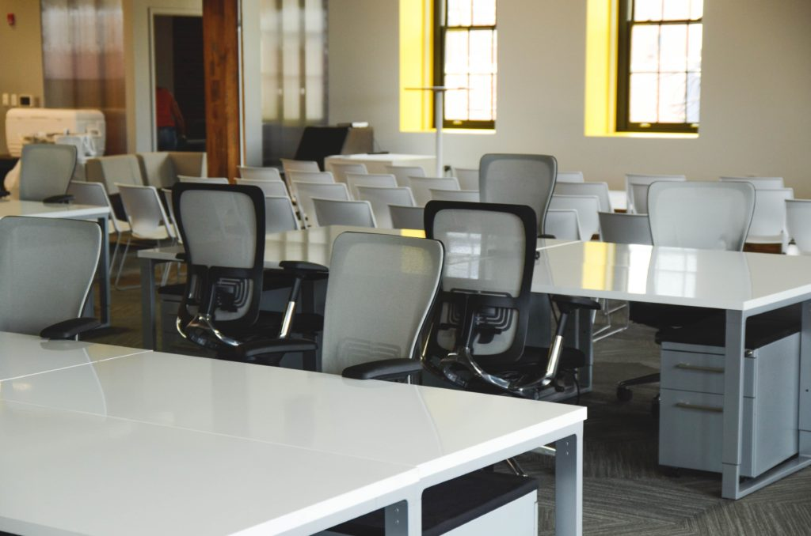

Nearly 50% of India’s workforce consists of millennials looking for flexible solutions when it comes to an office. We’re also the 3rd largest startup hub in the world. We boast an ever-increasing freelancer community that contributes towards a rising gig-based economy. It’s no wonder then that coworking spaces are the #futureofwork in India.

I mean, even major companies are climbing on the coworking bandwagon. ‘Approximately 40-45% of the business opportunity in coworking sector lies with mainstream corporate firms/large enterprises while small and Medium Enterprises (SMEs) along with individual professionals, together contribute another 35-40% of the demand for co-working space, followed by startups (15-25 percent).’ ([Source: Economic Times](https://economictimes.indiatimes.com/small-biz/startups/features/co-working-sector-is-hot-but-whats-fuelling-the-demand-for-cool-offices/articleshow/70186498.cms?from=mdr)).

Traditional companies are seeing the major benefits offered by coworking spaces such as flexibility, convenience of location, and less maintenance. Not only that, coworking spaces attract millennials and these companies have realized they will have access to younger talent with newer ideas by eschewing a regular office for a coworking one.

Coworking spaces are evolving beyond being cafés where a freelancer finds a seat and works away. They are upping the ante when it comes to what an office space should offer. You have shared offices that come fully equipped and with much-needed facilities like parking onsite, pantry, meeting rooms as well as recreational areas and green spaces among others. Every detail from the décor to the furnishings is well thought out.

They also work as a space where people can collaborate and innovate. There are a few coworking spaces that even have incubator and accelerator programmes, where startups can get guidance and grow. Smart offices are on the rise as well, and many coworking spaces have incorporated the latest technology to make work life as easy as possible.

Oh, and the popularity of coworking spaces isn’t restricted to major Indian cities like Bengaluru, Chennai, Hyderabad, etc. The concept is gaining ground and heading to tier 2 cities like Coimbatore, Kochi, and Chandigarh among others. There are plenty of emerging startups in these regions, which are driving the demand for coworking spaces. It serves as a space for like-minded people to gather and create and also helps retain talent in smaller cities.

### IN CONCLUSION

Let me end by saying coworking spaces are revolutionising the way we work. You could be in the creative field or have a tech startup. Maybe you’re a salesperson who is on the road a lot or an entrepreneur who needs to make a presentation to investors. There are coworking cafés and shared offices, conference rooms, and hotdesks all designed to meet your exact requirements.

This is a field that’s booming in India. According to this piece in [Outlook India](https://www.outlookindia.com/outlookmoney/real-estate/coworking-spaces-changing-face-of-indian-office-sector-3568), ‘Freelancers and even start-up employees and founders prefer a very flexible work environment and look for a place where they can build professional connections and even unwind.’

We’re going to find more coworking spaces coming up which are better designed, equipped with more amenities and providing plenty of opportunities to network and build a community. The #futureofwork in India is most definitely coworking spaces and it’s an exciting thing to be a part of!

<!--EndFragment-->
