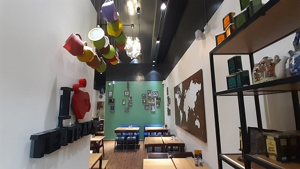
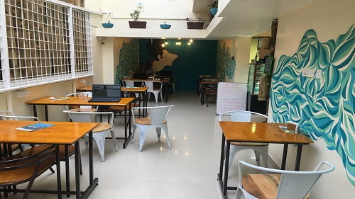
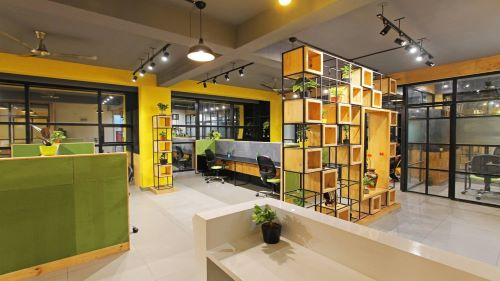
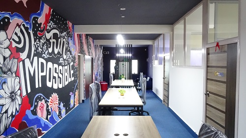

<!--StartFragment-->

Namma Ooru goes by many names, Garden City, Pub Capital and Silicon Valley of India. There’s no disputing the fact that this is the city for startups— Flipkart was started here, as was Swiggy, Big Basket and Practo… I could go on. It’s no wonder then that this is the city where visionaries, dreamers, and innovators come to.

On the flip side, you know that in a city like Bengaluru real estate is not cheap. But we don’t want a small thing like a lack of workspace come in the way of making your dream a reality. So, we’ve curated an extensive list of affordable coworking cafés and fully equipped shared offices across the city.

### HSR LAYOUT

[TEA TRAILS](https://app.gofloaters.com/#/home/explore/spacedetail/-L_BcyqwlhIes9J6Gp9m)

HSR Layout might be a relatively new neighbourhood in this city. But being so close to multinational companies and IT parks, a lot of working people choose to live here. If you’re one of those people, you know it takes an age getting in and out of the area. So, why not step into Tea Trails to work, instead? Find a chair, order a pot of tea if you feel like and get on with your tasks. The décor is warm and inviting and makes it an ideal meeting spot as well.

### INDIRANAGAR

[CAFÉ COFIX](https://app.gofloaters.com/#/home/explore/spacedetail/-LcelU353GbaEZzuO-Ad)

You can’t argue with the fact that Indiranagar is the place to be in the city! Tons of restaurants, cafés, and stores line the streets. And new ones are popping up every day. And thanks to the popularity of the area, rents are high. But at Café Cofix, you can work out of and enjoy the neighbourhood without worrying about your wallet becoming lighter. The fun interiors of this café will inspire you to work on your project. And you pay by the hour and only have to order food and drink if you want to.

### JP NAGAR

[Trendy shared workspace](https://app.gofloaters.com/#/home/explore/spacedetail/-Le1LLjd0N74044YI0eo)

In bengaluru, you know that finding a good parking spot is about as rare as observing a solar eclipse. This especially holds true for the up-market area of JP Nagar. Which is why a shared office space like this that comes with free onsite parking is something to hold on to. It also helps that the office space has lovely and bright design elements, and comes equipped with projector, whiteboard, and Wi-Fi among others.

### HALASURU

[Quirky shared workspace](https://app.gofloaters.com/#/home/explore/spacedetail/-LdScRQRTh4NvG_ZI2fg)

This crowded and busy area near the lake is one of the oldest neighbourhoods in the city. Traffic can be nightmarish in bengaluru, as you well know, so if your coworkers and you live in the area or the surrounding areas of Indira Nagar, MG Road etc, this is an ideal location and it makes sense to rent out this shared office space. It comes fully loaded with a printer, copier among other things. And the décor is funky and happy, making it a fun and creative space to work from.

Like what you see? We have over 50 coworking spaces in Bengaluru alone! These include coworking cafés and restaurants, shared offices and meeting and event spaces. We’re also constantly adding new spaces, so check out our [complete list](https://app.gofloaters.com/#/LandingPage) of coworking spaces in the city and find one that fits your budget and need!

<!--EndFragment-->
