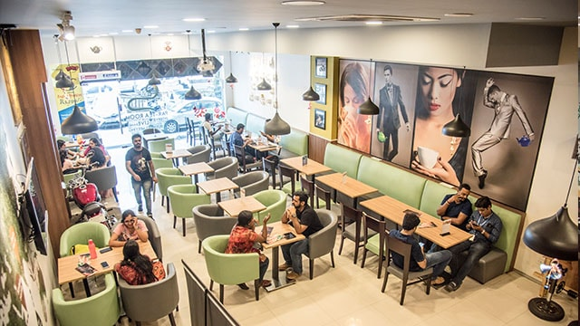
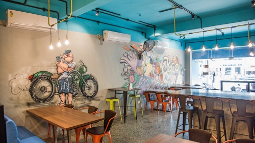
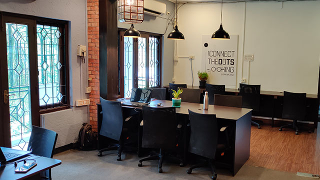
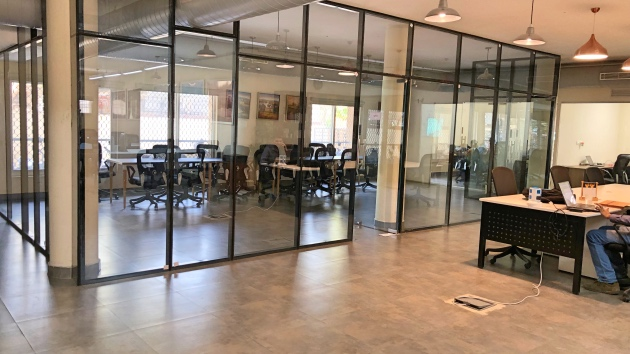
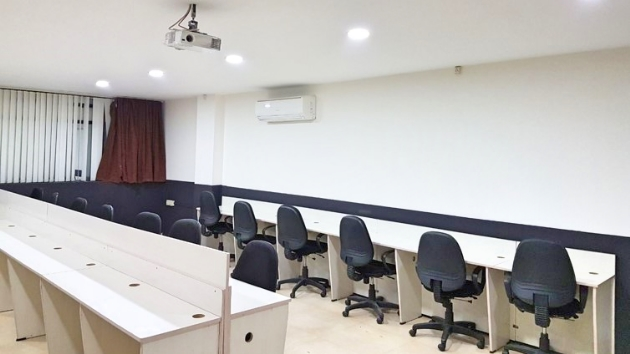

<!--StartFragment-->

The city by the sea, which is celebrating 380 years of existence, is constantly evolving and growing. From the IT corridor along OMR to the cultural sabhas of Mylapore, this is a city of contrasts and you’ll find people from various walks of life living here.

So, whether you’re a writer working on your magnum opus, or a graduate from one of the city’s well-known engineering colleges setting up your own business—this city has a space for you.

### NUNGAMBAKKAM

[Tea Trails Nungambakkam](https://app.gofloaters.com/#/home/explore/spacedetail/-LYRoLHtLYXNAZZDnU_0)

Finding a space to work out of in this upscale neighbourhood would normally set you back quite a bit. This is after all a much sought after residential area where a lot of well-known personalities live. But at Tea Trails Nungambakkam, you can find a seat and work in peace in a charming setting. You only pay for hours you use the space and the best part is if the need should arise, you have some flavourful teas on hand.

### ECR

[Jugo Café, Thiruvanmiyur](https://app.gofloaters.com/#/home/explore/spacedetail/-LSsQB6X4US3t_Kg7-e1)

If you live on ECR (East Coast Road), you know the road is gridlocked in the mornings with school buses and office goers, and the evenings aren’t much better with commuters heading back. So, why not settle yourself at Jugo Café that is conveniently located between Thiruvanmiyur and Kotivakkam. You beat the traffic and get your work done by making this colourful and inviting space your office for the day.

### T.Nagar

[Hotdesks, T. Nagar](https://app.gofloaters.com/#/home/explore/spacedetail/-LhqAZ3qFUR0WKktmMkd)

With plenty of shops and office buildings coupled with narrow streets and crowds, you’d be hard-pressed to find a quiet spot to work out of in T. Nagar. It’s GoFloaters to the rescue! If you find yourself on the move and in and out of meetings in this bustling locale, why not check in to one of these hotdesks and get your work done between appointments.

### TEYNAMPET

[Shared office space, Teynampet](https://app.gofloaters.com/#/home/explore/spacedetail/-Ll1xC_bU6EvaOQ4AP4Q)

If you live in this part of the city you’ll be spending more hours commuting to work than at the office, especially in the mornings. Thanks to the numerous educational institutions located here you’ll have plenty of school and college buses clogging the roads. So, do yourself a favour and rent this shared office space instead. Your team and you can focus and work in this space that is well designed and comes equipped with all amenities.

### OMR

[Shared office space, Perungudi](https://app.gofloaters.com/#/home/explore/spacedetail/-LBkG3ezRzMV9bi3PnDw)

Every business worth its salt wants an office on OMR–after all, it is the IT hub of the city. This means prices are high here and spaces don’t always come up for rent. But you needn’t worry because we’ve got you covered with this shared office space in Perungudi. Neat design, unfussy and functional, you can book a single seat or multiple ones for you and your team.

No matter the kind of space you require or the budget you’re on or the locality you’re interested in, we’ve got a spot. Click here to check out our complete list of coworking spaces, which include [cafés](https://www.gofloaters.com/cafe-coworking/), [shared offices](https://www.gofloaters.com/shared-office-space/) and [meeting and event spaces](https://www.gofloaters.com/meeting-rooms/), in Chennai to find one that suits your exact needs.

<!--EndFragment-->
