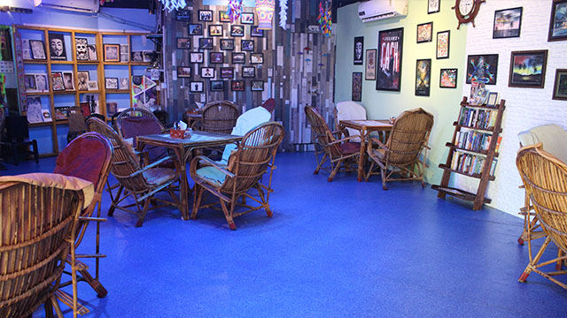
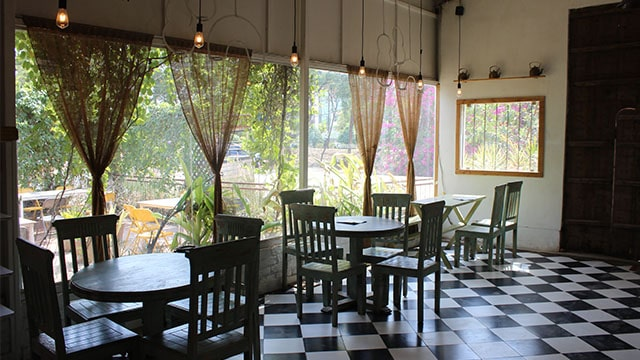
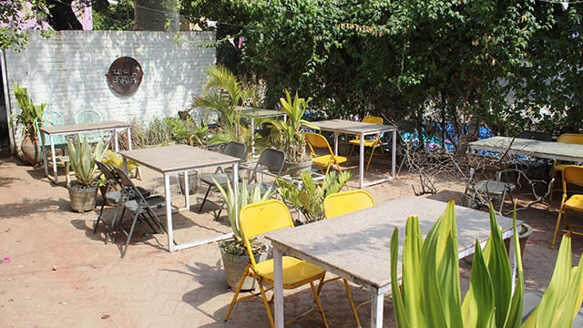
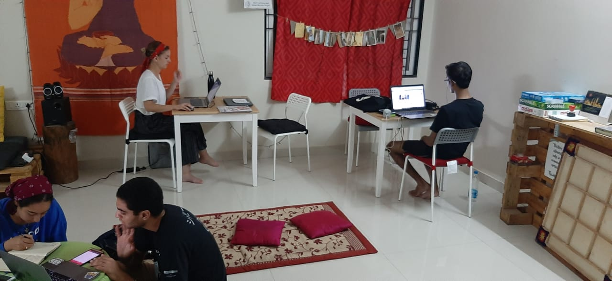
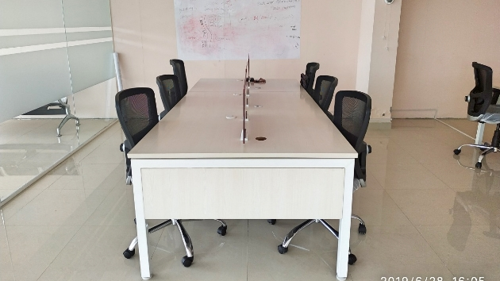
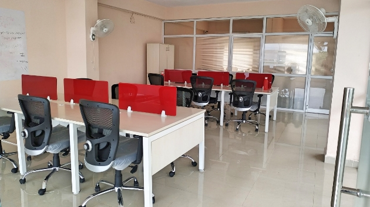

<!--StartFragment-->

The city of biryani and most recently breweries has one foot in the past with its rich history and monuments and one foot in the future with its tech and pharma industries—and it balances on both effortlessly. With more space to spread out and newer infrastructure compared to cities like bengaluru and Chennai, this is a city that is booming with a number of companies and startups setting up shop here.

### Kondapur

[84 Anjuna Shack](https://app.gofloaters.com/#/home/explore/spacedetail/-LdhoqTAxew8Gal33JFR)

This is the business centre of the city—offices, hotels, and hospitals line the streets. Which means this is also a noisy, expensive area where traffic can be pretty bad. If you’re a freelancer or a solopreneur and live in the area or are a consultant in and out of meetings in the vicinity, you might be looking for a quiet place nearby to work out of—84 Anjuna Shack is a great option! With comfy cane-work chairs and colourful décor, this is a small slice of Goa in this fast-paced city. Slow down and create and ideate here. If hunger should strike, you can order from the menu that drew inspiration from the shacks of Goa.

### Kompally

[Chai Kahani](https://app.gofloaters.com/#/home/explore/spacedetail/-LdhFJZEc4Lcv-I9B5vh)

Many people choose to live in this neighbourhood—case and point the number of residential complexes coming up in the area. This is mainly because in this part of the city you can still afford to buy a place, and rents are more reasonable. So, if you live here and work solo or are part of a startup, you might need a space nearby to work from. Make your way to Chai Kahani and grab a seat and get cracking. It’s a lovely and tranquil space with indoor and outdoor seating, where you can sip on some tea (if you want to) while you work on your masterpiece or have a meeting.

### Banjara Hills

[Shared office space](https://app.gofloaters.com/#/home/explore/spacedetail/-Llqn9vi2x2UfVgw9x6J)

This posh area of the city where the who’s-who live, might be too pricy an area to have an office of your own—especially if you’re part of a startup or are a freelancer. Thankfully, you have this shared office space located in a quiet part of the neighbourhood. The vibe is collaborative and chill and inspires creativity. You can order in food and there is indoor and outdoor seating. So show up, network and make your dream a reality in this space.

### IDPL

[Shared office space](https://app.gofloaters.com/#/home/explore/spacedetail/-Lla8B24mnmaCwfpmvYO)

The road widening taking place in this part of the city and the constant construction has given rise to lots of traffic and congestion. Which is why if you live in this part of the city you might not want to travel too far to work. We can help! This shared office space is perfect for your team and you to run your business out of. It’s functional and neat and comes with free onsite parking (which is always a major bonus)!

Whether you’ve got a great business idea that you want to put into motion or you’re part of a startup, you need an affordable space to work out of and that’s where we can help you. Check out our complete list of [coworking cafés](https://www.gofloaters.com/cafe-coworking/) and restaurants, [shared offices](https://www.gofloaters.com/shared-office-space/) and [meeting and event spaces](https://www.gofloaters.com/meeting-spaces/) in your city.

<!--EndFragment-->
