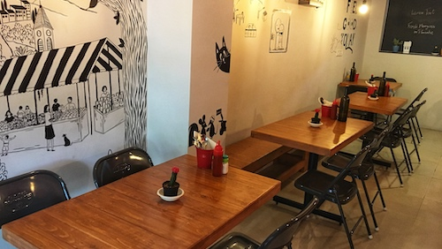
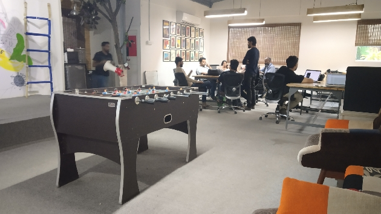
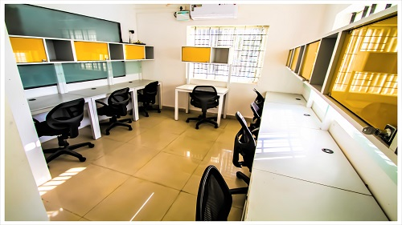

<!--StartFragment-->

Who would have thought this sleepy neighbourhood filled with families and retirees would, in just a decade, become the place to be in Bangalore (Bengaluru). Restaurants and pubs line the streets, the vibe of the area is fun and free, and you’ll find people walking everywhere. On the flip side, the popularity of the area has made property prices skyrocket and the narrow streets aren’t able to contain the traffic. Nevertheless, everyone wants to live here and party here and even work here!

### Coworking cafés

**Eddy’s Café**

[Eddy’s café](https://app.gofloaters.com/#/home/explore/spacedetail/-LaWLa8Qeny4oKU98-Ny) is located in the posh part of Indiranagar—Defence Colony. This is a neighbourhood of lovely homes and stately apartments blocks. If you live in the area or find yourself in the vicinity for a meeting, this is a cozy and inviting space to work out of. You can choose to sit inside or outside, and there is food and beverages on hand if you need. Ooh, the place is pet-friendly, so you can bring your dog to work with you. This is a great place in the middle of a busy area to create and discuss in peace.

### Shared offices

**Fun and creative**

Want to work out of Indiranagar and enjoy the perks of the neighbourhood? Is the only thing holding you back the high rents? We’ve got you covered. If you have a startup or a small business [this shared office space](https://app.gofloaters.com/#/home/explore/spacedetail/-LftQjh0hqoqk-I1zxMh) is perfect. It’s affordable, inspires creativity and comes jam-packed with every amenity. And the best part is you won’t run out of restaurants and pubs to visit with your colleagues for lunch or happy hour.

**Compact and warm**

Thanks to the paying guest accommodations available in the area and people renting out parts of their homes, tons of professionals and freelancers live in Indiranagar. And if you live anywhere in the city you know traffic can be a nightmare! So instead of spending hours on the road, why not work near home? Have a meeting in the outdoor seating area of [this shared office space](https://app.gofloaters.com/#/home/explore/spacedetail/-LdSiETFtRn_f0l87257), or find a quiet desk inside and get working. Along with Wi-Fi, projector and whiteboard among others, there is also free onsite parking available I kid you not!

Don’t worry about traffic or high rents or accessibility. Whatever your need and budget, GoFloaters has got you covered when it comes to workspaces. Check out our complete list of coworking spaces in the city [here](https://www.gofloaters.com/cafe-coworking?location=Bengaluru).

<!--EndFragment-->
