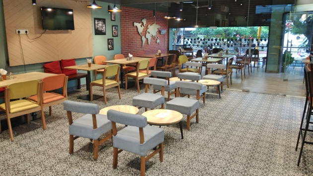
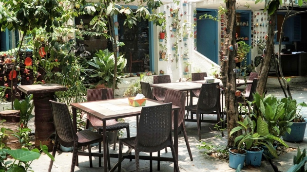
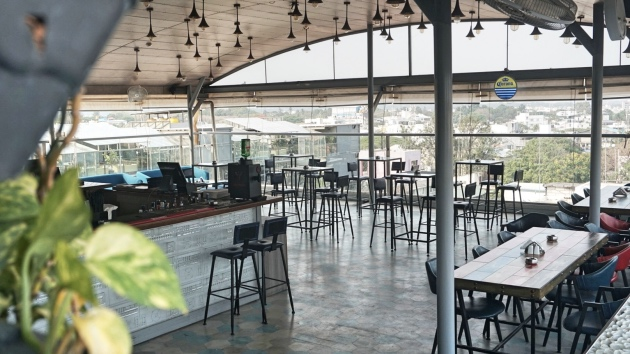
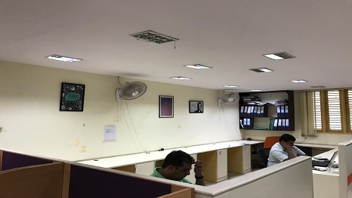

<!--StartFragment-->

Koramangala with its wide roads (when compared to other parts of the city), tree-lined streets, beautiful homes and aesthetic apartment buildings has always been a much sought after neighbourhood to live in.

When the tech boom happened, this area that is in between Electronic city and bengaluru proper, took off. Young professionals flocked to live here. Which meant tons of offices, restaurants, pubs and commercial buildings came up.

The other side of the coin is that tons of development work are constantly happening like construction projects, the building of the Ejipura- Kendriya Sadan flyover, and new sewage pipes being put in among others. Roads are constantly being dug up and structures being demolished. Which means residents have to face traffic woes along with noise and air pollution. So, if you live in this area you definitely want a space close by to work from.

### Coworking cafés

**Tea Trails**

A warm and bright space in Koramangala, once you start working out of [here](https://app.gofloaters.com/#/home/explore/spacedetail/-LkgZ4lLqpEwAIw7gbV6) you won’t want to leave. There is indoor and outdoor seating to choose from and you’ll even have access to a printer and high-speed Wi-Fi. With comfortable seats and colourful décor, this is a nice spot to get some work done or have a meeting. It also helps that there is tea and food on hand if you needed.

**Bistro Claytopia**

You won’t believe you’re in the midst of Koramangala, when you’re working out of [this café](https://app.gofloaters.com/#/home/explore/spacedetail/-LTjRySCHwb-YkI8ovFq). It’s large, has indoor and outdoor space, lots of greenery and is far from the hustle and bustle outside. It’s hard to find a parking space in Bangalore, but luckily this café has free parking and it’s pet-friendly as well. So, bring your fur baby and sit and work here in peace.

**Indigo XP**

A lot of youngsters live in this part of the city—college students, young professionals, freelancers… you name it. So if you fall into any of those categories and need a place close to home to work on a group project or even solo, drop in at [Indigo XP](https://app.gofloaters.com/#/home/explore/spacedetail/-LbXdDBkTblffrw7mjcs). This place is massive! It’s spread over two floors, there’s plenty of seating, and food and drinks on hand to keep you going. And being located in one of the busiest parts of the area, this is the perfect spot to have a meeting as well.

### Shared office

Are you an entrepreneur living in Koramangala? Do you want to set up an office near home but are worried about the high rents in the area? Don’t worry! We’ve got you. [This shared office space](https://app.gofloaters.com/#/home/explore/spacedetail/-Le2tvd1769XrirumDsn) is neat and functional and can comfortably seat you and your coworkers. When you choose to work out of this space, you not only avoid a long commute to work but you also have a space to work out of where the rent won’t break the bank.

Yes, the area like the rest of the city comes with its fair share of problems. But people still choose to live here, for the great weather, the awesome places to drink and eat at, and the fun vibe that Koramangala boasts off. And with more offices allowing people to work remotely and taking to coworking cafés to beat the traffic, you can work close to home and not have to deal with long commutes. So, check out our complete list of coworking spaces in your city.

<!--EndFragment-->
