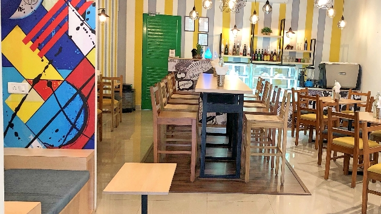
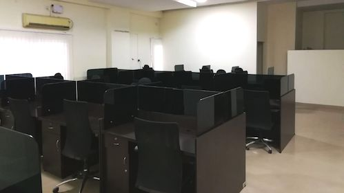

<!--StartFragment-->

The Hosur–Sarjapur Road Layout is a popular area to live and work from in Bangalore. It’s close to the IT parks, and being a suburb of the city rents are comparatively more affordable, so plenty of folks choose to live here and it has become the destination of choice for startups and small businesses

On the other hand, HSR layout comes with its fair share of problems as well. The area is filled with offices, apartments, hotels, and restaurants—which makes finding parking spots a nightmare. You know the horror stories you hear about traffic in Bangalore? Where people are stuck on the road for hours during their work commute, this is the area where a lot of that happens. Oh, and the potholed streets don’t help. So, if you live in the area you definitely want to stay close to home when it comes to finding a space to work.

### Coworking cafés

**Grapevine Café**

As I mentioned earlier, rents are affordable in HSR Layout, especially when compared to places like Koramangala or Indiranagar. If you live here and have the option to work remotely you’d definitely jump at it. Who wants to spend hours on the road! Instead, drop by at [Grapevine Café](https://app.gofloaters.com/#/home/explore/spacedetail/-LTWH_stK1c-26RNHgwE) and make it your office for the day. You can grab a bite to eat while you work if you feel like. And there’s even a private area where you can have an interview or meeting.

**Banoffee Café**

The terrible traffic in the area means commute times can run into an hour or more. So, many companies allow their employees to work from home in order to increase productivity. Luckily, you have spots like [Banoffee Café](https://app.gofloaters.com/#/home/explore/spacedetail/-LkAeC5H6N44Tz76ibbG), which is a bright, colourful and a welcoming oasis. With plenty of plug points and fast Wi-Fi, you can choose a seat indoors or outside and write or design away. Need some fuel to power through your work-load, there is food and beverage available to order.

### Shared offices

**Professional office space**

There’s a serious lack of parking spaces in HSR layout. Which has led people to park on the roads, pavements and in front of homes. This has not only annoyed a number of residents and pedestrians in the area but also given rise to traffic jams. So, when you find a [shared office space like this](https://app.gofloaters.com/#/home/explore/spacedetail/-LTgsY8oHhbAwvulvXtA), which comes with free onsite parking, you hold on to it! This shared office also has a meeting room available, which you can use for free for up to 2 hours. Oh, and you’ll be served complimentary coffee and tea!

HSR layout is one of the newer suburbs to have come up. It’s rapid growth and popularity has come with some major drawbacks—traffic and pollution. But by choosing to work close to home you can avoid both, to an extent. So, check out our [complete list](https://www.gofloaters.com/shared-office/) of coworking and meeting spaces in your area, to find one that is close to you and fits your budget.

<!--EndFragment-->
