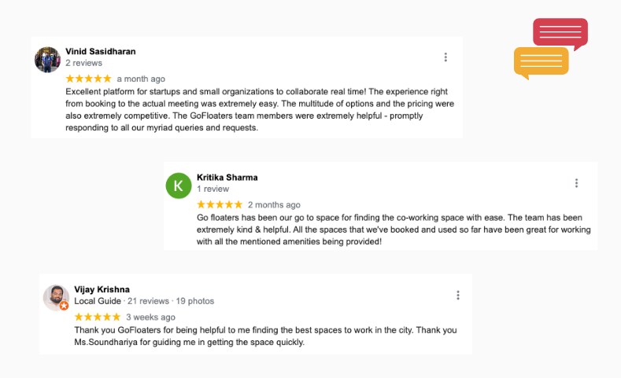
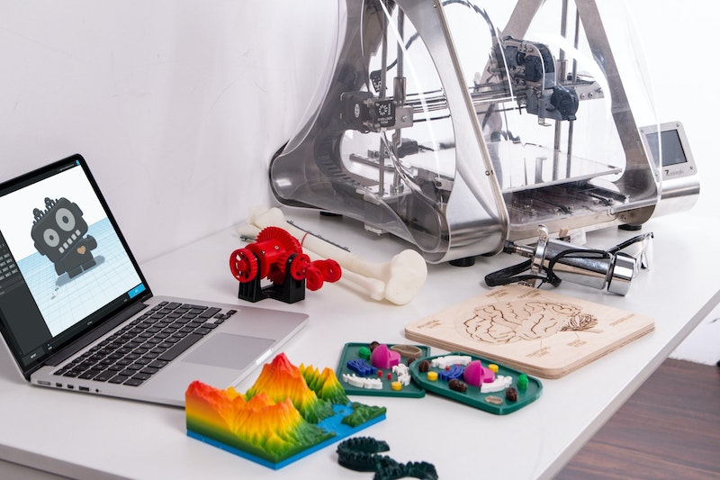

<!--StartFragment-->

 

Commercial real estate has had a bad 2020 for obvious reasons. Coworking has not been an exception to this. 2020 seems to be a temporary slowdown that could only lead to acceleration of adoption of coworking in India in 2021 and beyond. 

Businesses across the board are charting out plans for 2021 and beyond where they are doing one or more of the following:
1. [Reducing their footprint](https://economictimes.indiatimes.com/industry/services/property-/-cstruction/office-space-absorption-down-51-in-2020-bengaluru-information-technology-show-resilience/articleshow/80024541.cms) of leased and rented real estate. Office space absorption fell by 51% in 2020. 
2. Consolidation of offices in each city
3. Embracing a [hybrid remote work](https://www.bcg.com/en-in/publications/2020/managing-remote-work-and-optimizing-hybrid-working-models) approach. In a survey conducted by GoFloaters, 78% of the founders said that they were looking at hybrid remote work model.  
4. Some companies have decited to go 100% remote. 
5. Diversifying their footprint of employees across cities to take the advantage of remote working
6. Providing coworking passes like [GoFloaters for Teams](https://gofloaters.com/teams) to their employees to help them work near home

Coworking industry is seeing a silver lining in all these things that are happening in corporate India induced by COVID. They believe corporates of all sizes would embrace coworking spaces as against renting or leasing office spaces to get the much needed flexibility and savings. Experts also predict that leasing by coworking operators is [projected to increase](https://economictimes.indiatimes.com/industry/services/property-/-cstruction/post-covid-office-demand-changes-to-push-co-working-leases-42-in-2021/articleshow/79486065.cms) by 41% in 2021.

Experts are foreseeing these 5 trends to dominate coworking spaces in the coming years. 

 

- [1. Spread of coworking into suburbs, tier 2 and tier 3 cities](#1-spread-of-coworking-into-suburbs-tier-2-and-tier-3-cities)
- [2. Micro coworking](#2-micro-coworking)
- [3. Digital experiences](#3-digital-experiences)
- [4. Lease and rent giving way to on-demand and membership passes](#4-lease-and-rent-giving-way-to-on-demand-and-membership-passes)
- [5. More exclusive and niche coworking spaces](#5-more-exclusive-and-niche-coworking-spaces)

 

# 1. Spread of coworking into suburbs, tier 2 and tier 3 cities

Coworking was a metro and city center phenomenon till date. If you took a city for example Bengaluru you would find 80% of the coworking spaces in areas like Koramangala or Indiranagar. Startups and tech companies were concentrated here and this is where coworking players were too. With the pandemic induced adoption of remote working, startups and tech companies are making a permanent shift to hybrid coworking. 

Talent on the other hand has realized that it no longer make sense for them to stay near city center which also meant higher cost of living. We must also register that the lockdown has given all of us an appreciation of nature. This is also encouraging people to move closer to nature and away from the hustle and bustle of a city. 

Coworking players are now looking at expanding their operations into suburbs, tier 2 and cities of India. Some of these tier 2 cities are also becoming hubs of start ups. Indore and Coimbatore are prime examples of such a phenomenon. 2021 should see a lot of national and local coworking players open up coworking spaces in suburbs, tier 2 and tier 3 cities. Interesting new models of coworking are also at play here. This leads us to the next trend. 

 

# 2. Micro coworking
Coworking spaces were getting larger across the world to make the lease economics work. 2021 should see them shrink. 

Work is getting distributed. Companies are sourcing talent from all parts of India. As we saw with the previous trend suburbs, tier 2 and tier 3 cities or places where action would happen in the future. The current model of coworking where the player buys long and sell short will not work for such distribution of target audience. 

We already saw newer models of coworking emerge post WeWork debacle. One new model that we should expect to gain momentum in 2021 is that of micro coworking. 

Micro coworking spaces are small spaces that accommodate upto 40 or so members at any point in time. Micro coworoking spaces will be home to the creative workforce, independent professionals and people who find these are work near home spaces. You can also expect some non-traditional coworking players enter this market and provide space to the community that lives nearby. Cafes have been fullfilling this gap these years and their contribution is also expected to grow. 

 

# 3. Digital experiences
Everyone prefers low-touch to no-touch interactioms. Technology has shown us how it can be useful to create full digital interactions. Coworking players, atleast the small ones, had stayed away from embracing technology to provide superlative experience to their members thus far. 

COVID changes this as well. We should see access cards, coworking space management software, booking system, attendance system, automated invoices, keyless access powered by IOT etc enter and dominate the coworking space in the future. 

It should not be a surprise if you get an end-to-end digital experience from discover, to booking and use of the space without having to make a phone call or talk to someone. Platforms like [GoFloaters](https://gofloaters.com) & [MyHQ](https://myhq.in) are already enabling this across multiple spaces. 

 

 

# 4. Lease and rent giving way to on-demand and membership passes
Flexibility is the name of the game for startups and SMBs. Many of us have learnt it the hard way that having long-term commitments will be detrimental to our companies.

Leases and long-term rental agreements will give way for flexi-passes. We are already seeing many startups and SMBs [give up completely on their offices](https://sundarns.medium.com/is-hybrid-remote-working-the-future-of-workplace-b82a6da810c3) and embrace remote working. Many of these startups have started to get an office space on-demand whenever they need to come together to collaborate. 

The below feedback that GoFloaters has received in the recent past should give you an indication why startups love on-demand offices. 

 

Globally we saw many leading players emerge to provide multi-location, multi-brand coworking passes like [DeskPass](https://www.deskpass.com/), [Breather](https://breather.com/) and [GoFloaters](https://gofloaters.com/teams). Coworking players are seeing this trend catching up and want to be ahead of the demand curve for flexi-passes and on-demand space consumption. OYO for example has [launched](https://www.oyoworkspaces.com/flexipass) its flexi-pass at Rs 2999/month. Similarly 91 Springboard launched its [COVID special](https://www.91springboard.com/covid-19-special-coworking-offer/) packages. 

While some of these were launched specifically to attract users during the peak of the pandemic, it is expected some of these packages and offers to become a permanent fixture.  

 

# 5. More exclusive and niche coworking spaces
Niche, industry specific and member demographic exclusive coworking spaces have started to spring up. [Makers Tribe](https://gofloaters.com/office-space/gooffice-1053-open-desks-perungudi-chennai/) is a coworking space in Chennai and is dedicated to makers. Similary [WSquare](http://wsquare.work/) is a coworking space and incubation center run by women for women led startups. [MakeOffices](https://makeoffices.com/) in Chicago is a coworking space that favors health-tech startups. 

These niche and industry specific provide the advantage of a close knit community of people who are similar to you and thus are going through or have gone through similar challenges. They also make you feel at home. Such niche spaces were not possible in the large format model. As micro coworking gains momentum, we should also see such niche and exclusive coworking spaces grow in numbers.

 

If you are a startup or a business owner you would see coworking spaces more suitable for you than before. With flex-passes on offer and packages that let your team work from anywhere, you should look at coworking as your way of working first before looking at other options. 

 

******

 

GoFloaters has been helping 1000s of freelancers and startups with their flexible office space requirement over the last 3 years. We are committed to providing affordable spaces on a pay-per-use model so thar you get to have an office when you and where you want. 

[GoFloaters for Teams](https://gofloaters.com/teams) helps teams embrace work from anywhere. It provides your team with a single pass to access over 1400 locations across 14 cities when you want. You get charged only when you use a space. 

<!--EndFragment-->