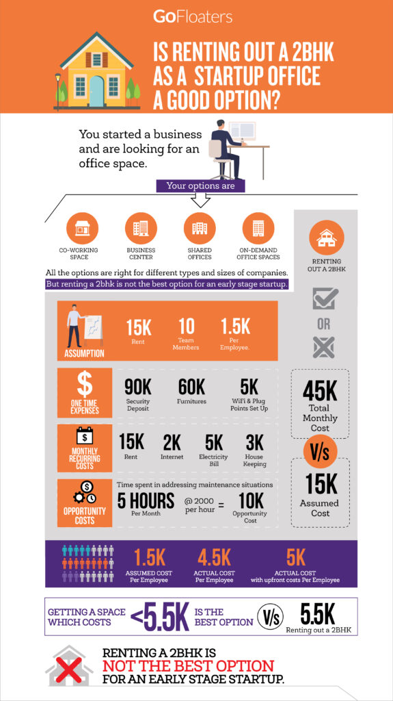

<!--StartFragment-->

You just started out a business and are looking at getting an office for your startup. This is such an emotional and critical decision for your startup. It is also a financial decision that you need to take. Options that you may be exploring will include the below:

- Co-working space
- Business center
- Shared offices
- On-demand office spaces (which is us)
- Renting out a 2BHK and converting it to an office

All the options are right for different types and sizes of companies. I strongly believe that the last option of rent out a home and converting that to an office is not the best option for an early stage startup. I submit my argument as below.

At the outset rent a 2BHK as an option sounds the cheapest of the lot. You should be able to get a 2BHK say at 15K as rent a month. You should be able to have a team of 10 work comfortably in a 2BHK. This comes to just Rs 1500 per employee. Hey that’s cheap. Whats wrong with that you ask? I just say your equation is flawed in a few ways. Rent that you pay is just a small part of the cost of running your office. Below are the few other things that you are not accounting for.

One time expenses:

- Rs 90,000 (6 months deposit at the minimum) of working capital that you are locking up as security deposit
- Rs 60,000 fitting out cost for furnitures (We are assuming that the space already has fans, ACs & lights)
- Rs 5,000 Wiring cost for WiFi and plug points for your set up
- Rs 10,000 for setting up UPS

Monthly recurring cost:

- Rs 15,000 monthly rent
- Rs 2,000 internet charges
- Rs 5,000 EB charges (more the Air Conditioning you may see a bigger bill)
- Rs 3,000 for a maid to clean the place
- Rs 10,000 for consumables (like coffee & tea, cleaning liquids etc) and maintenance

Above all, the cost that founders underestimate is the opportunity cost when you spend time on the office space that you have created rather the business that you want to build. Founders end up spending time in looking into and addressing situations like AC not working, maid did not turn up, maid quit, internet connection down etc. Let us say on an average 5 hours of such time is spent every month.

- Rs 10,000 of opportunity cost (assuming Rs 2000 / hr is the value of founders time)

If you just add all the recurring costs then you get a staggering **Rs 45,000 monthly** for your 2BHK office that initially looked very cost effective at Rs 15,000 a rent. This means that you are spending **Rs 4,500 per employee per month.** We have not even included the upfront costs that you have to take care. If you account for it then you are looking at a number not less than **Rs 5,500 per employee per month.**

The below infographic illustrates the data points and proves the point.

(Click the image to view and download a high resolution version.)

So in effect, if you get a space in your city at a per seat cost of less than Rs 5,500 per month then that option is going to be more cost effective than you taking up a 2BHK house on rent and converting it into your startups office. You can increase this number based on what you can afford.

Is cost the only factor? Cost is just one factor but many a times the most important factor in the whole decision process. You must consider all other factors comprehensively before you choose the right office for your startup.

All the best with your startup journey!

<!--EndFragment-->
